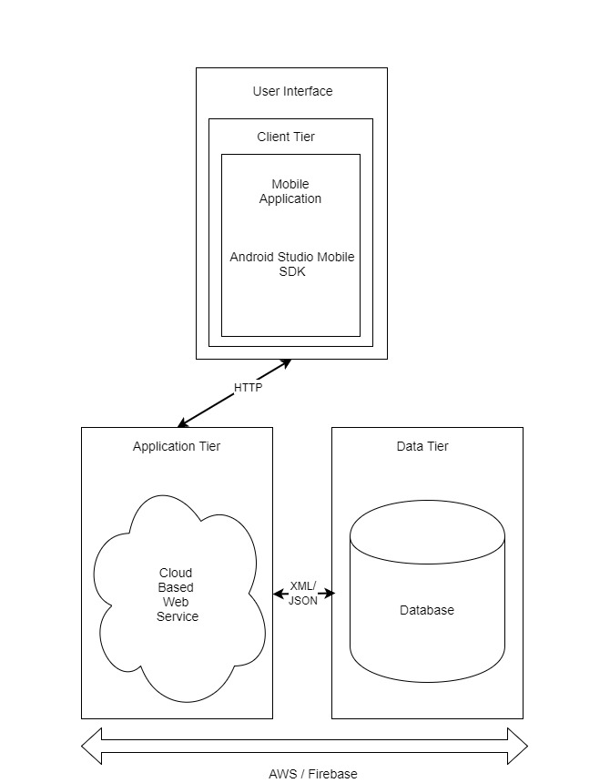
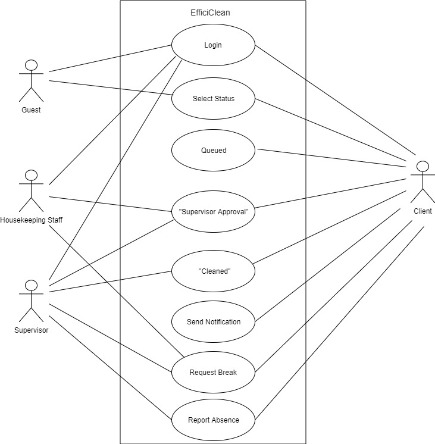
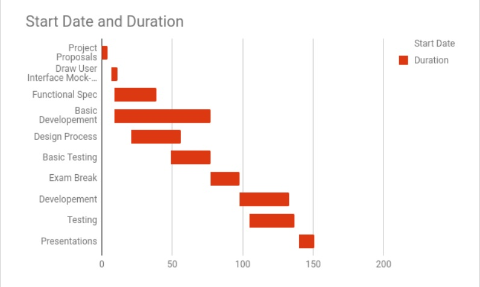

# CA326 Functional Specification - EfficiClean
### Team Members:
- Conor Hanlon
- Shauna Moran

# Table of Contents
- [**1. Introduction**](#1-introduction)
	+ [1.1 Overview](#11-overview)
	+ [1.2 Business Context](#12-business-context)
	+ [1.3 Glossary](#13-glossary)
- [**2. General Description**](#2-general-description)
	+ [2.1 Product/System Functions](#21-product-system-functions)
	+ [2.2 User Characteristics and Objectives](#22-user-characteristics-and-objectives)
	+ [2.3 Operational Scenarios](#23-operational-scenarios)
	+ [2.4 Constraints](#24-constraints)
- [**3. Functional Requirements**](#3-functional-requirements)
 	+ [3.1 External Requirements](#31-external-requirements)
 	+ [3.2 Functional Requirements](#32-functional-requirements)
- [**4. System Architecture**](#4-system-architecture)
- [**5. High-Level Design**](#5-high-level-design)
- [**6. Preliminary Schedule**](#6-preliminary-schedule)
- [**7. Appendices**](#7-appendices)

&nbsp;

# **1. Introduction**

## 1.1 Overview

Our idea in centred around the way housekeeping staff currently operate in hotels. At the moment, staff must walk up and down the halls in hotels to check what rooms have signs on them saying “Do not disturb” or “Please service my room”. Staff members are assigned a floor and if there are no rooms on their floor to be cleaned they must wait somewhere until they check the hall again. This system is extremely inefficient.

We intend to build an application that would modernise this area of work. Instead of guests using a piece of paper on the door to notify staff when rooms are available to be cleaned they will use this application to mark the status of their room and be notified when their room is cleaned. Cleaning staff will be able to see on a web interface when rooms are ready to be cleaned, be assigned rooms and mark them as completed. This will result in this process being more efficient, safer, more accessible and better kept track of. 

Each room in the hotel will have a QR code in the room. When guests scan this QR code the application will be downloaded and the guest will be presented with the login screen. All the guest will have to do here is enter their name. The application will then check the database to see if this guest is in the room. The user will then be logged into the application and be presented with home screen. Alternatively, if a guest is using a laptop of device without a QR scanner, under the QR code will be a URL that will be independent to that room. Like the app, the guest will enter their name and will be logged into the application.

The main features of our project are:

-	A staff interface diplaying the cleaning status of rooms in the hotel

-	Priority queue system for cleaning team allocation to hotel rooms

-	Remote notification for guests when their room is marked clean on the system

-	Guest login via QR code in hotel room alongside verification of guest by database query 

-	Option to add feedback and rate a room's clean

-	Database interaction to automatically log out guests when their stay is over

-	Staff work statistics generated for supervisor and manager

-	Randomly allocated cleaning pairs daily to increase security

&nbsp;

## 1.2 Business Context

Our application is aimed at the hotel industry and more specifically the housekeeping sector within hotels. The application will completely modernise this sector by introducing an interface which allows users to mark the status of their room as “Do not disturb”, “Please service my room” or “Checking out” rather than hanging signs on their room doors. EfficiClean will completely change how hotels manage their housekeeping by modernising the way guests request their rooms to be cleaned and how these are ordered to be cleaned.

This application will be attractive to hotels as it will not only improve the speed of the housekeeping in hotels, resulting in satisfied guests, but would also save the hotels money. As staff’s progress would be electronically tracked, staff could be paid room by room. This would mean that instead of having to pay staff hour by hour, hotels could just pay staff for the work they have done. On days where the hotel isn’t too busy, instead of playing a flat hourly rate, hotel’s would only have to pay for the small rooms that were occupied the night before to be cleaned. Hence, saving the hotel money.

Guests will benefit from EfficiClean as they will be able to mark their room’s status quickly and be placed onto a queue to be cleaned. If guests mark their room as “Please service my room”, they will be given a rough estimate of when a cleaning team will get to their room. Currently, guests have to guess how long they should leave their room for, which results in people wondering “Should I go back now?”, “Is it too early?” and even after waiting still sometimes returning to an uncleaned room. Efficiclean would completely eradicate this ambiguity that we all hate about getting our rooms serviced.  Once a guests room is completed and has been approved by a supervisor, they will receive a push notification to let them know that their room has been cleaned. This will make this experience more pleasant for guests as it will be efficient and provide a vast amount of information so that they are not left in the dark.

Supervisors will also be given their own interface on Efficiclean. Here they will be shown a progress chart showing how each team is getting on. They will also be presented with the options of “Clean approval”, “Hazards approval”, “Severe mess approval”, “Map view”, “Break approval” and “Report Absence”. By using Efficiclean, staff members will no longer have to search the hotel to find their supervisor to clean their room. Instead, they will simply request a room be approved and their supervisor will receive this request, wherever they are in the hotel.

The map view will allow the supervisor to monitor how their staff members are doing. Similar to the staffs map view this will provide a colour coded map showing which rooms need to be cleaned, which have been completed, which do not want to be cleaned and which are empty. Supervisors currently cannot see this information and must mark it all on paper room by room. The map will allow supervisors to see what rooms they must approve and know where their staff members are during the day.

Break approval and report absence are also available to the supervisor. Break approval means that a pair can simply type in when they want a break and how long of a break they would like. The supervisor can then accept or reject these and can also now easily monitor that too many pairs are not taking breaks at the same time. Reporting an absence is present on the application to inform the queue if a pair will not be working together. It will then we up to the supervisor to either leave this person by themselves or assign them to a three. This will ensure that absences and breaks are kept track of electronically for the supervisor to monitor.

Reception will also benefit from EfficiClean. Rather than reception having to call the housekeeping supervisor to check if rooms are available if guests arrive early, they will have their own interface on the system. This interface will only contain a simplified version of the map view. Reception will have the ability to see when a room, which guests have checked out of, is in progress or has been completed. They can then instantly know if they can allow a guest to guest to check in early without any inconvenience. 

Reception will also have an input in the system when guests check out. If a guest has not clicked “Checking out” this can be done by receptionists on their user interface. Once a guest has checked out, the receptionist, instead of calling the housekeeping manager to let them know, can click on the room on their user interface and mark the room as “Checking out”. This room will then be added to the queue like the other rooms to be cleaned.

Finally EfficiClean would benefit the housekeeping staff themselves. Staff progress will be monitored so the staff that complete more work will receive more pay. This also means that if staff members clean a large number of rooms early, they will be able to go home early, but still possibly receive the same pay they would for a whole day’s work. Staff would be more motivated to get the work done and be rewarded when they do.

&nbsp;

## 1.3 Glossary

**Housekeeping**
The department of employees who manage and perform cleaning tasks in hotels.

**Integration**
The act of combining or adding parts to make a unified whole

**QR Code**
A matrix bar code that is read by photographing it with the camera of a smartphone or other mobile device that is equipped with a bar-code reader.

**Accessible**
Easy to approach, reach, enter, speak with, or use.

**Decrement**
 The act or process of decreasing; gradual reduction.
 
 **Hazardous substance**
 A 'hazardous substance' is any substance that has one or more of the following intrinsic 'hazardous properties': Explosiveness. Flammability. Ability to oxidise (accelerate a fire) Human toxicity (acute or chronic)

&nbsp;

# **2. General Description**

## 2.1 Product/System Functions

####  __Guest Functionality__

##### Login

Guests will be instructed to scan a QR code in their room to download EfficiClean. This will bring them to the login page for their room. All the guest will have to do is enter their first name and surname. This will be checked against the database to ensure that this guest is in this room. If the guest is in this room, the guest will be logged in and will be presented with the home screen.

##### Status

On the home screen, guests will be presented with three buttons. “Please service my room”, “Do not disturb” and “Checking out”. The guest simply clicks which button applies to them. If the guest clicks “Please service my room” they will be given a rough estimate of when a cleaning team will get to their room. Once their room has been completed  they will receive a push notification to let them know that they can return to their room. If a guest clicks “Do not disturb” they will be given the option to change their rooms status until a specified time. Once a guest’s room has been cleaned they will be provided with an optional feedback form which will be forwarded on to management.

##### Notification

Once a guest’s room has been cleaned and approved by a supervisor, the guest will receive a push notification to alert them that their room has been completed. This will remove any ambiguity about when guests should return to their rooms and remove any stress from the situation. This will make the experience more pleasant for guests and staff as guests will not return when their room is “In Progress”.

#### __Staff Functionality__

##### Login

As a staff login must be more secure than the guest login, staff members will be presented with the same initial login page as guests but will then have a second login page. On the initial login page staff members must enter “staff” in the surname box and then their username in the forename box. They will then be presented with a screen to enter their password. Once they have successfully completed these steps a staff member will be logged in.

##### Teams

Currently, for security reasons, rooms are cleaned by pairs of housekeeping staff. To further secure this process, EfficiClean will assign random teams every day. These teams will be visible on the staff homepage of the application.

##### Queue

Rooms will be added to a queue once a guest marks them as “Please service my room” or “Checking out”. Rooms will not only be added in the order that they are placed on the queue but also in the order that is most efficient for cleaning staff to clean them as they progress through a hallway. The queue will operate on a priority system as to incentivise guests to use the application. Cleaning staff will also be placed on a queue to assign them to rooms.

##### Map

This function will make it easy for staff members to see exactly what status each room is in and what progress the staff of the day are making as a whole.  This will provide a colour coded map showing which rooms need to be cleaned, which have been completed, which do not want to be cleaned and which are empty. 

##### Supervisor Approval

To remove the inefficiency of staff members having to locate their supervisor to approve what rooms they have cleaned, we will include supervisor approval in EfficiClean. Once a team have completed a room, they will then send the room into “Supervisor Approval” status. This will mean that supervisors can easily monitor what rooms they must check and remove any time wasting from this process.

##### Staff Break

Instead of having to go find their supervisor to ask if they can go on a break, staff members can request breaks on the application. They select what time they are going at and how long of a break they will be taking. The supervisor can then approve or reject breaks while keeping in mind how many people are already on break at this time. 

#### __Supervisor Functionality__

##### Progress Chart

On the supervisor interface, they will be given an option to view the progress of cleaning staff. This page will display all the teams alongside the amount of rooms they have cleaned that they, helping supervisors monitor the work rate of staff.

##### Map

Supervisors will be presented with the same map as regular staff members except instead of seeing rooms assigned to them, they will see what rooms they have to approve. Similar to the staff map, this will provide a colour coded map showing which rooms need to be cleaned, which rooms need to be approved, which have been completed, which do not want to be cleaned and which are empty. 

##### Approvals

The supervisor will be able to approve a large number of different requests on their user interface. This includes cleans approval, hazard approval,severe mess approval and break approval. The first of these three include the supervisor going to the specified room and checking it. The latter is for allowing staff members to go on a break at a specific time. Adding this functionality to the application means that in any of these instances, staff members will not have to go find the supervisor but can do this electronically.

##### Absence

Supervisors will also be able to report staff absences on to the system. They will have the option to either leave the absentees’ partner by themselves or assign them to a group of three. This will ensure that absences are kept track of electronically for the supervisor to monitor.

#### __Reception Functionality__

##### Map

Reception will be provided with a simpler map than both the staff and the supervisor. To eliminate the need to call housekeeping staff with information every time a guest checks in or checks out they will have their own interface on the system. Reception will have the ability to see when a room, which guests have checked out of, is in progress or has been completed. They can then instantly know if they can allow a guest to guest to check in early without any inconvenience.They will also be able to mark a room on the system as “Checking out” if a guest checks out without marking this on the system themselves.

&nbsp;

## 2.2 User Characteristics and Objectives
EfficiClean is aimed primarily at hotel management, supervisors, staff and guests. As the app is aimed at a wide variety of people it will be used by people of all ages and technical abilities. This will mean that our application must have an easy to use interface which can be used by anyone. Our user interface must be accessible as it may be used by people with accessibility requirements such as screen readers. We would also hope that EfficiClean would be available in multiple languages as it is an application that can be used anywhere in the world.

As EfficiClean already has a very simple home screen which consists of four buttons, we must ensure that the colour contrast, sizing and accessibility of these are all designed well. 

&nbsp;

## 2.3 Operational Scenarios

#### __Scenario One: Login__

##### Current System State:
User scans the QR code in their room which will download the application and open the login page for their room.

##### Informal Scenario:
The user must then enter their forename and surname into the text boxes on screen to verify that they are staying in this room.

##### Next Scenario:
The user will then be successfully logged into the application and will be presented with the home screen.

#### __Scenario Two: Room marked as "Please service my room"__

##### Current System State:
The user will select the “Please service my room” on the homepage of the user interface. They will be given an estimated time of when their room will be serviced. This room will be added to the queue of rooms to be cleaned.

##### Informal Scenario:
When the room reaches the top of the queue it will assigned a team of housekeepers to service the room. This team will clean the room and then mark the room as “Supervisor Action”. The supervisor will then see the room on their “To be approved” list and must ensure that the clean is up to a high enough standard. If they find that the food is properly cleaned they will mark the room as “Cleaned”.

##### Next Scenario:
The user will then receive a push notification to let them know that the room has been cleaned. If they open the application after the room has been cleaned they will be given the option to give feedback on the service their room has received. This feedback will be sent directly to management.

#### __Scenario Three: Room marked as "Please service my room" and hazardous__

##### Current System State:
The user will select either the “Please service my room” or “Checking Out” buttons on the homepage of the user interface. They will be given an estimated time of when their room will be serviced. This room will be added to the queue of rooms to be cleaned.

##### Informal Scenario:
When the room reaches the top of the queue and a pair of staff members go to clean the room they will notice a hazardous substance such as blood in the room. They will immediately leave the room and submit this as a “Hazardous” room for approval to their supervisor. The supervisor will then see this room on their list of hazardous rooms to be approved. Once the supervisor approves that their is a hazardous mess, the staff will be added back onto the queue with a priority of one so that they can immediately get a different room. The supervisor will contact an external cleaning team to handle the hazardous mess.

##### Next Scenario:
The room will be placed back on the queue once the external cleaning team are finished with a priority of one to ensure it is cleaned straight away.

#### __Scenario Four: Room marked as "Please service my room" and very messy__

##### Current System State:
The user will select either the “Please service my room” or “Checking Out” buttons on the homepage. As before, they will be given an estimated time of when their room will be serviced. This room will be added to the queue of rooms to be cleaned.

##### Informal Scenario:
When the room is due to be serviced a cleaning team will enter the room and find it to be very messy. The staff will immediately mark the room as “Very Messy” for supervisor approval. Once the supervisor approves this the staff may clean the room and keep record of any damages in the room. When these staff members are finished with this room, the system will calculate the average number of rooms cleaned in this period by the other cleaning teams. This number will be set as this team’s priority and this will be decremented every time they complete a room. This will give the team an opportunity to catch up with the work they missed while dealing with this room.

##### Next Scenario:
The room will be marked as “Supervisor Action” for the supervisor to check the room to see if it is cleaned to a high enough standard. Once they approve this clean it will be marked as “Cleaned” and will be available for the guests staying in the room or people who are checking into the hotel.

#### __Scenario Five: Room marked as "Do not disturb"__

##### Current System State:
User doesn’t want their room serviced so marks the room as “Do not disturb”.

##### Informal Scenario:
This room will not be added to the queue and will be marked as red on the staff map view. The user will be given an option until a predetermined time to change the status of their room.

##### Next Scenario:
The room will not be serviced and the user will have the option to choose their room’s status again the following day.

#### __Scenario Six: Room marked as "Checking out"__

##### Current System State:
When checking out of a hotel a user will mark their room as “Checking out” and the room will be added to the list of rooms to be cleaned.

##### Informal Scenario:
When the room reaches the top of the queue, a pair of housekeeping staff will be assigned to the room. As this room requires a deeper clean as guests are checking out it will they longer. Once they have cleaned the room they will mark the room as “Supervisor Action” the supervisor will then check that the room is up to a high enough standard and mark the room as “Cleaned”. As the staff members have spent longer on this room, they will be returned to the queue with a priority of one to make up for the time they have spent on this room.

##### Next Scenario:
Once this room is marked as “Cleaned” it will appear as green on the Reception user interface. This will mean that reception can check people in early as the room is available.

#### __Scenario Seven: Requesting a break__

##### Current System State:
Two staff members working together decide they want a break at 12:00 for 30 minutes. 

##### Informal Scenario:
They use EfficiClean to get this break approved by their supervisor. They select the time and length of the break they wish to take. This request it submitted to the supervisor. The supervisor can see how many staff members are taking break at this time and if it is okay for the team to take their break.

##### Next Scenario:
The supervisor approves this break and the team receive a notification to alert them that their break has been approved.

&nbsp; 

## 2.4 Constraints

#### Integration Requirements
The primary constraint that we will face is integrating this system with the current system used in hotels. We must ensure that our system would allow for an easy transition and attract users.

#### Time Constraints 
As this project is due on the 9th of March, time is a constraint which we will have to take into consideration when deciding what we would like to add to EfficiClean.

#### User Requirements
Although we may have many ideas about what users would like to see on EfficiClean we must include users throughout the process to understand what they would like to see implemented.

#### Security Requirements
As we will be using a database of hotel guests and their room numbers we must be very careful with this private information and be sure it is very secure.

&nbsp;

# **3. Functional Requirements**

## 3.1 External Requirements

#### Hardware
For a hotel to adopt this system, they would need to provide access to their database to interact with the guest verification system, as well as a strong wifi connection for guests to use. EfficiClean generates two QR codes per hotel room which would need to be put up just inside the room door. Staff would need a tablet to allow them to interact with the system. Guests who want to avail of the application will need either a smartphone, laptop or tablet.

#### Software
The system should run smoothly on all different operating systems. Handheld devices should be running Android (minimum API 18, Android 4.3 Jelly Bean) as well as an application or in-built camera feature for scanning QR codes. 

#### Environment
In order for guests and staff to be able to use the application, the hotel will have to provide a wifi connection that stretches across all floors of the hotel. Guests must also stay logged in for the duration of their stay in order to receive push notifications when their room has been serviced.

## 3.2 Functional Requirements

### 3.2.1 Functionality of the QR code

#### Description
There are 2 QR codes per room: one for if the guest has the app already and one which downloads it. Both then send the guest to their relevant login screen.

#### Criticality
While it is not essential for downloading the app as it will be available on the play store, it is necessary to send the user to the correct login page for their room, making it easier for guests to login successfully. 

#### Technical Issues
The main issue would be making sure each generated QR code brings you to the specified room page.

#### Dependencies with other requirements
Without the QR codes, guests will be unable to login to the app, breaking the whole system. 

### 3.2.2 Login

#### Description
When the guests scan their QR code, they are presented with the login screen of EfficiClean. Guests input their forename and surname which is then validated with the information in the database to ensure they are staying in the room. Staff will input their username and password to log in.

#### Criticality
The guest validation at the login stage is crucial to the app’s functionality. Without proper verification, anybody could mark the statuses of hotel rooms and sabotage the system.

#### Technical Issues
The login page must interact correctly with the database, so it is essential that the data is correct and updated correctly between guest changes.

#### Dependencies with other requirements
The login page depends on the scanning of the QR code, because without this function the correct login page will not be displayed.

### 3.2.3 Functionality of a guest

#### Description
When a guest logs in to the app, they will be presented with their home screen with the three options “Please service my room”, “Do not disturb”, and “Checking out”. They select which option they want to choose, and this information is processed and displayed on the map view as well as the queue relevantly updated.

#### Criticality
This system centres around interacting with guests, so it is important that guests comply with the system and use this application. It will work better with a higher ratio of users to non users, as the queue will integrate with the old system more smoothly.

#### Technical Issues
The marking of the status of the guest will be relatively straightforward to pass into the system. One issue we will face is displaying an accurate estimate of the time when a guest’s room will be finished, which will be based off their position in the current queue.

#### Dependencies with other requirements
How a guest interacts the app fully influences the actions of housekeeping staff and the queue system. The amount of rooms which are assigned to the queue affects how quick staff complete the rooms as well as how many times staff will have to check the halls for tags on doors. Guests also depend on the login function to access the app.

### 3.2.4 Functionality of housekeeping staff

#### Description
The housekeeping staff login to the app with their own personal username and password. When on duty, their team is active on the staff queue system. When they reach the top of the queue they are assigned a cleaning job from the room queue. They service that room then mark it ready for supervisor approval.

#### Criticality
Staff must use the system correctly for the application to run as efficiently as possible. If they are slow in their marking of room status or forget completely, then the room will be left with the status of “Cleaning in progress” and the housekeeping team won’t be added to the queue to receive another task. 

#### Technical Issues
The main technical issue which could be faced is the implementation of the map view for housekeeping staff. An SVG map will display the status of rooms by colour code, which requires efficient and precise interaction with the database to acquire the correct room status as it appears in real time.

#### Dependencies with other requirements
The actions of guests play a large part in the functionality of housekeeping staff. Staff are also involved in nearly all the roles of the supervisor, from room approval to break requests. Staff also need to use the login system to access their own profile. 

### 3.2.5 Functionality of a supervisor

#### Description
The supervisor monitors and manages the housekeeping staff. They receive all staff approval requests, break requests and report staff absences. They can also allocate break times and monitor a team’s progress.

#### Criticality
While the supervisor has an important role in the system, it is not as crucial as the staff of guests. Its main function is to give the final approval on rooms, which in reality could be done by staff. However the supervisor approval adds an extra level of security, and is also how most hotels operate. 

#### Technical Issues
The supervisor also has a map view, so the same issues of the housekeeping staff apply in this case. When breaks are allocated to a team, the queue must be able to remove that specific team at the allocated time and also give the staff a fair position on their return.

#### Dependencies with other requirements
The supervisor deals mainly with staff. The supervisor decides their break time and staff might also have to revisit a room if it is deemed not up to standard. They must also approve any serious damages or hazardous waste in rooms. Along with guests and staff, supervisors utilise the login function.

&nbsp;

# **4. System Architecture**

&nbsp;

# **5. High-Level Design**

## Context Diagram

.jpg)

&nbsp;

## Use Case Diagram

&nbsp;

## Use Case Descriptions

### Use Case 1 : Login to App

| **Use Case 1**             |Login to App      |  Details|
|----------------------------|:-----------------:|:----------------------------:                                                                       |
|__Goal in Context__          |                  | Guest inputs details and accesses their account                                                     |
|__Preconditions__            |                  |User has scanned their QR code and has been brought to the login page,User has an internet connection|
|__Success End Condition__    |                  |User is successfully logged in                                                                       |
|__Failed End Condition__     |                  | User cannot access their account                                                                    |
|__Primary, Secondary Actors__|                  | Guest,Housekeeping Staff, Supervisor, Client                                                        |
|__Trigger__                  |                  |User inputs their details at the login screen                                                        |
|__Description__              |__Step__          |__Action__                                                                                           |
|                             |1                 |User is presented with the login screen.                                                             |
|                             |2                 |User enters their forename and surname.                                                              |
|                             |3                 |User clicks login button.                                                                            |
|                             |4                 |Client verifies user’s details.                                                                      |
|                             |5                 |User is successfully logged in.                                                                      |
|__Extensions__               |__Step__          |__Branching Action__                                                                                 |
|                             |2a                |User does not enter the name of the guest staying in this room.                                      |
|                             |2b                |User is asked to contact reception.                                                                  |
|__Variations__               |__Step__          |__Branching Action__                                                                                 |
|                             |2a                |User is a member of staff                                                                            |
|                             |2b                |User enters their username and “staff”                                                               |
|                             |2c                |User brought to second login page where they must enter their password.                              |

&nbsp;
### Use Case 2 : Select Status

| **Use Case 2**              | Select Status     | Details                                                                                             |
|-----------------------------|:-----------------:|:----------------------------:                                                                       |
|__Goal in Context__          |                   |User selects the status of their room.                                                               |
|__Preconditions__            |                   |User has logged into their account.                                                                  |
|__Success End Condition__    |                   | User has successfully selected their room’s status.                                                 |
|__Failed End Condition__     |                   |User cannot select their room’s status.                                                              |
|__Primary, Secondary Actors__|                   | Guest, Client                                                                                       |
|__Trigger__                  |                   | User selects the room’s status.                                                                     |
| __Description__             |__Step__           |__Action__                                                                                           |
|                             |1                  |User presented with select status screen.                                                            |
|                             |2                  |User selects either “Do not disturb”, “Please service my room” or “Checking out”.                    |
|                             |3                  |Client returns pop up to inform guest what status they have selected.                                |
|                             |4                  |The room is either marked as “Do not disturb” or added to the queue.                                 |
|                             |5                  |Room status has been successfully selected.                                                          |
|__Extensions__               |__Step__           |__Branching Action__                                                                                 |
|                             |2a                 |User selects “Do not disturb” but changes their mind.                                                |
|                             |2b                 |Hotel can have an inbuilt time to select status by and this status can be changed before this time.  |
|__Variations__               |__Step__           |__Branching Action__                                                                                 |
|                             |1a                 |User doesn’t use the application. User places tag on their door.                                     |

&nbsp;
### Use Case 3 : Supervisor Approval

| **Use Case 3**              |Supervisor Approval |Details                                                                                             |
|-----------------------------|:-----------------:|:----------------------------:                                                                       |
|__Goal in Context__          |                   | Staff place room in status “Supervisor Approval”                                                    |
|__Preconditions__            |                   |Staff member has logged in, accepted a room and has internet connection.                             |
|__Success End Condition__    |                   |Room has been marked as “Supervisor Approval”                                                        |
|__Failed End Condition__     |                   |Room has not been given “Supervisor Approval” status                                                 |
|__Primary, Secondary Actors__|                   |Housekeeping Staff, Supervisor, Client                                                               |
|__Trigger__                  |                     |Staff member sends room to “Supervisor Approval”                                                   |
| __Description__             |__Step__           |__Action__                                                                                           |
|                             |1                  |Staff member notices a hazard in the room.                                                           |
|                             |2                  |Staff member flags room for supervisor approval.                                                     |
|                             |3                  |Staff member inputs a description of the hazard in the room.                                         |
|                             |4                  |They click submit to supervisor.                                                                     |
|                             |5                  |Client verifies that a description has been input.                                                   |
|                             |6                  |Room is placed in “Supervisor Approval”                                                              |
|__Extensions__               |__Step__           |__Branching Action__                                                                                 |
|                             |2a                 |Staff member notices hazard such as blood.                                                           |
|                             |2b                 |Staff member must leave the room and then place room in “Supervisor Approval” status.                |
|__Variations__               |__Step__           |__Branching Action__                                                                                 |
|                             |1a                 |Room is cleaned and doesn’t contain a hazard.                                                        |
|                             |1b                 |Room is marked as “Cleaned” and sent into “Supervisor Approval” status.                              |
|                             |1a                 |Staff member has requested a break.                                                                  |
|                             |1b                 |This room is submitted for supervisor approval.                                                      |
&nbsp;
### Use Case 4 : Request Break

| **Use Case 4**              |Request Break      |Details                                                                                              |
|-----------------------------|:-----------------:|:----------------------------:                                                                       |
|__Goal in Context__          |                   | Staff team request a break.                                                                         |
|__Preconditions__            |                   | Staff team have logged in to the app and have an internet connection.                               |
|__Success End Condition__    |                   | Team have successfully requested a break.                                                           |
|__Failed End Condition__     |                   | Team are unable to request a break.                                                                 |
|__Primary, Secondary Actors__|                   | Housekeeping Staff, Supervisor, Client                                                              |
|__Trigger__                  |                   |Staff member click into request break option.                                                        |
| __Description__             |__Step__           |__Action__                                                                                           |
|                             |1                  |Staff member opens the request break option from the home screen.                                    |
|                             |2                  |They first input the time they would like to go on break.                                            |
|                             |3                  |Secondly, they select the duration of the break they wish to take.                                   |
|                             |4                  |They then click submit.                                                                              |
|                             |5                  |The client ensures that a valid time and duration are selected.                                      |
|                             |6                  |The break has been accepted and sent to the supervisor for approval.                                 |
|__Extensions__               |__Step__           |__Branching Action__                                                                                 |
|                             |5a                 |A valid time and duration are not entered.                                                           |
|                             |5b                 |An error message is presented to the staff member to edit their submission.                          |
|__Variations__               |__Step__           |__Branching Action__                                                                                 |
|                             |1a                 |Team are asked by supervisor to go on break at a certain time.                                       |
|                             |1b                 |Supervisor will input the break time into the system.                                                |
&nbsp;
### Use Case 5 : Report Absence

| **Use Case 5**              |Report Absence     |Details                                                                                              |
|-----------------------------|:-----------------:|:----------------------------:                                                                       |
|__Goal in Context__          |                   | Supervisor reports a staff member as absent                                                         |
|__Preconditions__            |                   |Supervisor has logged in and has internet connection                                                 |
|__Success End Condition__    |                   | Staff member is reported as absent.                                                                 |
|__Failed End Condition__     |                   | Staff member has not been reported as absent.                                                       |
|__Primary, Secondary Actors__|                   | Supervisor, Client                                                                                  |
|__Trigger__                  |                   | Supervisor clicks “Report Absence” on home screen.                                                  |
| __Description__             |__Step__           |__Action__                                                                                           |
|                             |1                  |Supervisor selects “Report Absence”                                                                  |
|                             |2                  |Supervisor types in the name of the staff member who is absent.                                      |
|                             |3                  |Supervisor submits this.                                                                             |
|                             |4                  |Client checks that this is a valid staff name.                                                       |
|                             |5                  |Client removes this staff member from their pair for the day.                                        |
|                             |6                  |Client reorganises the pairs the way in which the hotel has selected.                                |
|                             |7                  |New teams are posted.                                                                                |
|__Extensions__               |__Step__           |__Branching Action__                                                                                 |
|                             |4a                 |Supervisor has not entered a valid staff name                                                        |
|                             |4b                 |They are asked to check the name and try again.                                                      |

&nbsp;

# **6. Preliminary Schedule**

### Gantt Chart

### Critical Tasks

|**Critical Task Name**                  |**Start Date** | **End Date**|**Duration (in days)**|
|----------------------------------------|:-------------:|:-----------:|:--------------------:|
|Project Proposals                       |23/10/2017     |27/10/2017   |4                     |
|Draw User Interface Mock-Ups            |30/10/2017     |03/11/2017   |4                     |
|Functional Specification                |01/11/2017     |01/12/2017   |30                    |
|Basic Developement                      |01/11/2017     |08/01/2018   |68                    |
|Design Process                          |13/11/2017     |18/12/2017   |35                    |
|Basic Testing                           |11/12/2017     |08/01/2018   |28                    |
|Exam Break                              |08/01/2018     |29/01/2018   |21                    |
|Developement                            |29/01/2018     |05/03/2018   |35                    |
|Testing                                 |05/02/2018     |09/03/2018   |32                    |
|Presentations                           |12/03/2018     |23/03/2018   |11                    |

&nbsp;

# **7. Appendices**

-   Firebase: https://firebase.google.com/

-   SVG Map Maker: http://mapsvg.com/mapsvg/

-   ZXing: https://zxing.org/w/decode.jspx
   