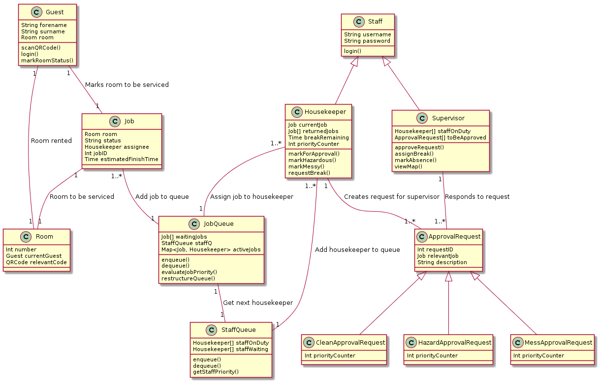
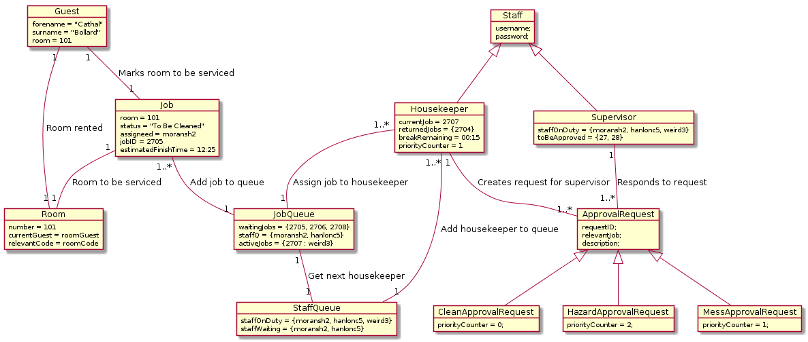
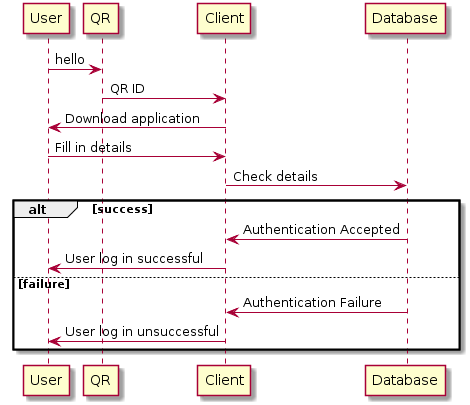
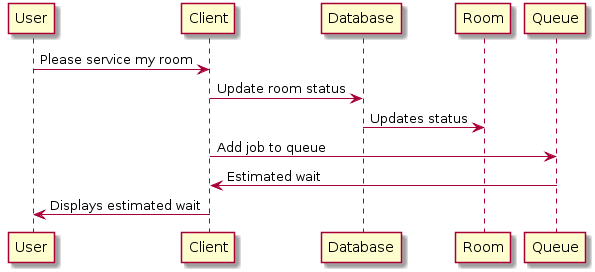

# 3. High Level Design

## 3.1 Component Model

A component diagram shows the the structural relationship between components of a system. In the above diagram we see that the android application is made up of push notifications, registration and services. Registration can be broken down into Google Development Console, Google Firebase Console and Google Services. Services are made up of the Firebase Dispatcher and finally Push Notifications are generated using One Signal which itself is built on Google Firebase. Each of these components combined build the Android application Efficiclean.

## 3.2 Data Flow Diagram

A data flow diagram is a graphical representation of the is the flow of data through a system. As we can see in the above diagram users in our system interacts with nine key processes. These processes then interact with seven data sources. For example in this diagram we can see hoe the user interacts with the Login process. The user sends a login request to the Login process. This process sends this login information to the authentication data source. This information is either accepted or rrejected. This is returned to the Login process and the user is notified.

## 3.3 Class Diagram

Class diagrams illustrate the relationships and dependencies among classes. Efficiclean has 12 classes detailed in the above diagram, These being Guest, Staff, Job, Housekeeper, Supervisor, Room, JobQueue, ApprovalRequest, StaffQueue, CleanApprovalRequest, HazardApprovalRequest and MessApprovalRequest. From the diagram above we can see how each of these classes interact with one another.

## 3.4 Object Diagram

An object diagram is an instance of a class diagram. This is a snapchat of the system at a moment in time. An example of an instance of our class within our class diagram is the Guest class. In this instance our guest's name is Cathal Bollard and he is staying in room 101.

## 3.5 State Machine

*Login *                  | *Please Service*            |*Request Break*
:------------------------:|:---------------------------:|:-----------------------:|
| |

State machines show the changing state of a single object and the transitions between these states. Here we can see the changing state of the Login, Please service my room and Request break objects of Efficiclean. As we can see from the Please service my room object, we move through six stated to perform this action.

## 3.6 Sequence Diagram

*Login *   | *Please Service*    |*Request Break*
:-------------------:|:-----------------:|:-------------:|
| |

Sequence diagrams show object interactions arranged in time sequence. Here we can see the Login, Please service my room and request break objects. We can also see the messages exchanged between objects needed to carry out these scenarios. For example in the Login sequence diagram we can see the sequence of events involved in logging in a user. We also have an alt box to represent a success or failure condition present in the sequence.
