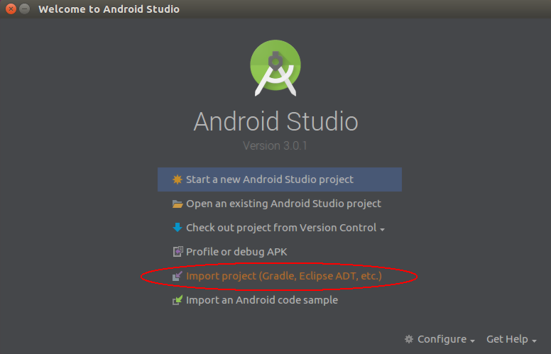
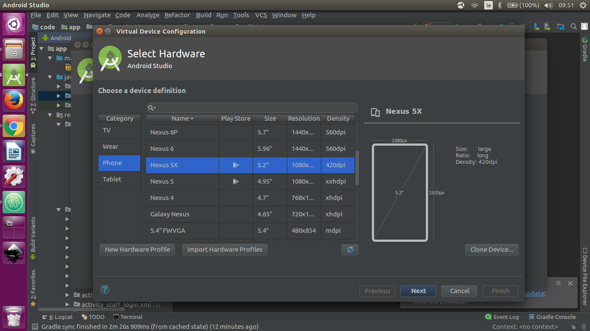
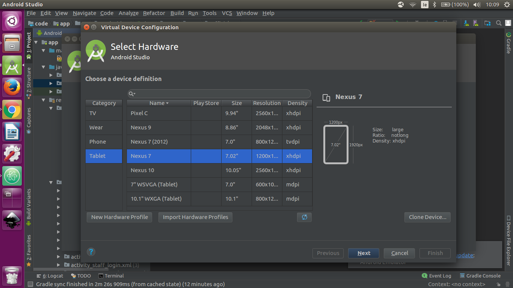

# Installation and Configuration

### Required Software

  - Android Studio Version 3.0.1
  - Java 8

### Instructions

##### Building the Android Project

- Choose were you would like the project to be stored.
- Create a folder here to store the project.
- Open a terminal.
- Navigate to your chosen folder.
- Execute the command: git clone https://gitlab.computing.dcu.ie/hanlonc5/2018-CA326-chanlon-efficiclean.git
- Open Android Studio

- Select Import project(Gradle, Eclipse ADT, etc) as highlighted in the screenshot above
- Navigate to “C:\Users<User>”YOUR CREATED DIRECTORY PATH” \2018-CA326-chanlon-efficiclean”

- Click "Code"
- Click "Ok"
- The project will now build

#### Set up the emulator

- On the Toolbar at the top of the page click "Tools"
- Select "Android"
- Select "AVD Manager"

- Select "Create Virtual Device"

##### Mobile Emulator

- Select Phone
- Selct Nexus 5X as highlighted below

- Select "Other Images"
- Select "Lollipop API level 21" as highlighted below
- Click "Download"

- Click "Finish"
- Select "Lollipop API level 21" as highlighted above
- Click "Next"
- Click "Finish"

##### Tablet Emulator

- Select Phone
- Selct Nexus 7 as highlighted below

- Select "Other Images"
- Select "Lollipop API level 21" as highlighted below
- Click "Download"

- Click "Finish"
- Select "Lollipop API level 21" as highlighted above
- Click "Next"
- Click "Finish"

### Running the Application

- On the Toolbar at the top of the page click "Run"
- Select "Run App"
- Select your AVD "Nexus 5X API 21" (mobile) or "Nexus 7 API 21" (tablet)
- Click "Ok"
- The application will now launch
