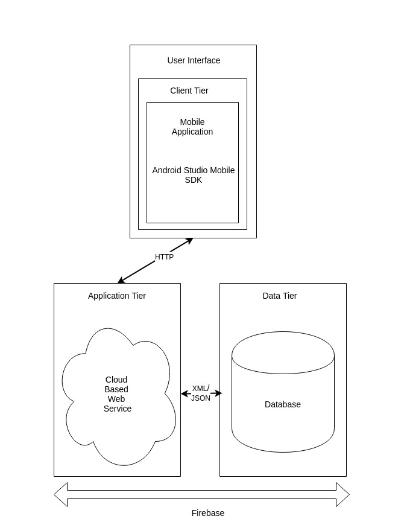

# System Architecture

## 2.1 Development Environment

The Efficiclean application was developed in Intelliji Ultimate version 2017.3.4. It consists of twelve classes and 25 XML files. Our user interface was built for mobile, 600dp tablet and 720dp tablet screen sizes. The application targets Android API level 21. This reason for this being essential softwares involved in Efficiclean such as Firebase JobDispatcher, Vector Master View and Asynchronous task schedueling all require this API level or above. While we tried to build our project on a lower API level, it simply was not feasible with the features we wished to implement in our application. This API level covers approximately 70% of Android users. Google play services and firebase services were also utilised in the building of Efficiclean.

## 2.2 System Architecture Diagram

- Efficiclean's systems architecture has two major elements, the application and the Firebase database.

- The application itself has Has three layers, the User Interface, the Client Tier and the Android Studio Mobile SDK.

- Efficiclean was developed using the Android Studio software development kit.

- The User Interface consists of 25 user pages designed for mobile and two different tablet screen sizes, 600dp and 720dp.

- The Client Tier outlined in the diagram connects the Android application to the Firebase database. Firebase is a cloud hosted environment. The Client Tier connects to the web server through HTTP. Data moves up and down a Web Socket channel between the NoSQL database and Android application. These web sockets push the data to the Client so that the user does not have to refresh the application.

- The Application Tier of Firebase connects the database to the Client Tier of the Android application. This is done through a combination of HTTP and Web Sockets.

- JSON and XML are used to pass data between the application and the Application Tier.

- The applications data is in the Data Tier. This includes a vast amount of information from guest names and room numbers to staff names, approval requests and room status'. The data is stored as JSON data and is contained in a NoSQL database. We use our Google Services JSON file to create the link our application to the firebase console.

- The Application and Data Tier combined are the Firebase database which was utilised to create Efficiclean. 
