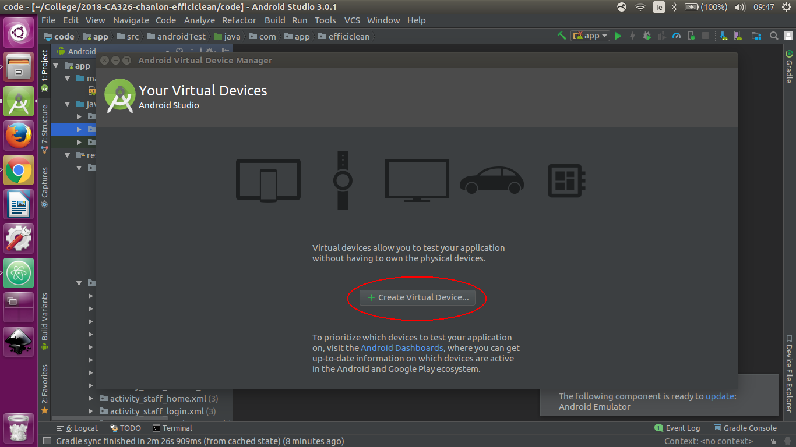

# CA326 Technical Specification - EfficiClean
### Team Members:
- Conor Hanlon
- Shauna Moran

# Table of Contents
- [**1. Introduction**](#1-introduction)
	+ [1.1 Overview](#11-overview)
	+ [1.2 Glossary](#12-glossary)
- [**2. System Architecture**](#2-system-architecture)
	+ [2.1 Development Environment](#21-development-environment)
	+ [2.2 System Architecture Diagram](#22-system-architecture-diagram)
- [**3. High Level Design**](#3-high-level-design)
	+ [3.1 Component Model](#31-component-model)
	+ [3.2 Data Flow Diagram](#32-data-flow-diagram)
	+ [3.3 Class Diagram](#33-class-diagram)
	+ [3.4 Object Diagram](#34-object-diagram)
	+ [3.5 State Machine](#35-state-machine)
	+ [3.6 Sequence Diagram](#36-sequence-diagram)
- [**4. Problems and Resolutions**](#4-problems-and-resolutions)
- [**5. Installation and Configuration**](#5-installation-and-configuration)
&nbsp;

# 1. Introduction
## 1.1 Overview

Our idea in centred around the way housekeeping staff currently operate in hotels. At the moment, staff must walk up and down the halls in hotels to check what rooms have signs on them saying “Do not disturb” or “Please service my room”. Staff members are assigned a floor and if there are no rooms on their floor to be cleaned they must wait somewhere until they check the hall again. This system is extremely inefficient.

We intend to build an application that would modernise this area of work. Instead of guests using a piece of paper on the door to notify staff when rooms are available to be cleaned they will use this application to mark the status of their room and be notified when their room is cleaned. Cleaning staff will be able to see on a web interface when rooms are ready to be cleaned, be assigned rooms and mark them as completed. This will result in this process being more efficient, safer, more accessible and better kept track of.

Rooms will have a QR code for users to download the application. They will enter their hotel ID and Room Number which will be within their room. Alongside this information, users enter their forename and surname. The application will then check the database to see if this guest is in the room. The user will then be logged into the application and be presented with home screen. Guests will also use this method of logging in on the web application.

The main features of our project are:

-	A staff interface displaying the cleaning status of rooms in the hotel

-	Priority queue system for cleaning team allocation to hotel rooms

-	Remote notification for guests when their room is marked clean on the system

-	Database interaction to automatically log out guests when their stay is over

-	Staff work statistics generated for supervisor and manager

-	Randomly allocated cleaning pairs daily to increase security

&nbsp;

## 1.2 Glossary

**Housekeeping**
The department of employees who manage and perform cleaning tasks in hotels.

**Integration**
The act of combining or adding parts to make a unified whole

**QR Code**
A matrix barcode that is read by photographing it with the camera of a smartphone or other mobile device that is equipped with a bar-code reader.

**Accessible**
Easy to approach, reach, enter, speak with, or use.

**Decrement**
 The act or process of decreasing; gradual reduction.

 **Hazardous substance**
 A 'hazardous substance' is any substance that has one or more of the following intrinsic 'hazardous properties': Explosiveness. Flammability. Ability to oxidise (accelerate a fire) Human toxicity (acute or chronic)

&nbsp;

# 2. System Architecture

## 2.1 Development Environment

The Efficiclean application was developed in Intelliji Ultimate version 2017.3.4. It consists of twelve classes and 25 XML files. Our user interface was built for mobile, 600dp tablet and 720dp tablet screen sizes. The application targets Android API level 21. This reason for this being essential softwares involved in Efficiclean such as Firebase JobDispatcher, Vector Master View and Asynchronous task scheduling all require this API level or above. While we tried to build our project on a lower API level, it simply was not feasible with the features we wished to implement in our application. This API level covers approximately 70% of Android users. Google play services and firebase services were also utilised in the building of Efficiclean.

## 2.2 System Architecture Diagram

- Efficiclean's systems architecture has two major elements, the application and the Firebase database.

- The application itself has Has three layers, the User Interface, the Client Tier and the Android Studio Mobile SDK.

- Efficiclean was developed using the Android Studio software development kit.

- The User Interface consists of 25 user pages designed for mobile and two different tablet screen sizes, 600dp and 720dp.

- The Client Tier outlined in the diagram connects the Android application to the Firebase database. Firebase is a cloud hosted environment. The Client Tier connects to the web server through HTTP. Data moves up and down a Websocket channel between the NoSQL database and Android application. These Websockets push the data to the Client so that the user does not have to refresh the application.

- The Application Tier of Firebase connects the database to the Client Tier of the Android application. This is done through a combination of HTTP and Websockets.

- JSON and XML are used to pass data between the application and the Application Tier.

- The applications data is in the Data Tier. This includes a vast amount of information from guest names and room numbers to staff names, approval requests and room status'. The data is stored as JSON data and is contained in a NoSQL database. We use our Google Services JSON file to create the link our application to the firebase console.

- The Application and Data Tier combined are the Firebase database which was utilised to create Efficiclean.

&nbsp;

# 3. High Level Design

## 3.1 Component Model

A component diagram shows the the structural relationship between components of a system. In the above diagram we see that the android application is made up of push notifications, registration and services. Registration can be broken down into Google Development Console, Google Firebase Console and Google Services. Services are made up of the Firebase Dispatcher and finally Push Notifications are generated using One Signal which itself is built on Google Firebase. Each of these components combined build the Android application Efficiclean.

## 3.2 Data Flow Diagram

A data flow diagram is a graphical representation of the is the flow of data through a system. As we can see in the above diagram users in our system interacts with nine key processes. These processes then interact with seven data sources. For example in this diagram we can see how the user interacts with the Login process. The user sends a login request to the Login process. This process sends this login information to the authentication data source. This information is either accepted or rrejected. This is returned to the Login process and the user is notified.

## 3.3 Class Diagram

Class diagrams illustrate the relationships and dependencies among classes. Efficiclean has 12 classes detailed in the above diagram, These being Guest, Staff, Job, Housekeeper, Supervisor, Room, JobQueue, ApprovalRequest, StaffQueue, CleanApprovalRequest, HazardApprovalRequest and MessApprovalRequest. From the diagram above we can see how each of these classes interact with one another.

## 3.4 Object Diagram

An object diagram is an instance of a class diagram. This is a snapchat of the system at a moment in time. An example of an instance of our class within our class diagram is the Guest class. In this instance our guest's name is Cathal Bollard and he is staying in room 101.

## 3.5 State Machine

*Login *                  | *Please Service*            |*Request Break*
:------------------------:|:---------------------------:|:-----------------------:|
| |

State machines show the changing state of a single object and the transitions between these states. Here we can see the changing state of the Login, Please service my room and Request break objects of Efficiclean. As we can see from the Please service my room object, we move through six stated to perform this action.

## 3.6 Sequence Diagram

*Login *   | *Please Service*    |*Request Break*
:-------------------:|:-----------------:|:-------------:|
| |

Sequence diagrams show object interactions arranged in time sequence. Here we can see the Login, Please service my room and request break objects. We can also see the messages exchanged between objects needed to carry out these scenarios. For example in the Login sequence diagram we can see the sequence of events involved in logging in a user. We also have an alt box to represent a success or failure condition present in the sequence.

# 4. Problems and Resolutions

- QR codes

- Asynchronous issue preventing login

- Push Notification being sent to all Users

- JobQueue not interacting automatically with StaffQueue

- Application crashing when updating database values which are being displayed

- Black Boxes being displayed on SVG Map Overview

- Bottoms of names in tables being cut off

- Issue referencing specific path in vector drawable

- Guest Sign Out not working correctly

### QR Codes

#### Problem

Initially, we had planned for users to download the application using a QR code which would be present in their room. This QR code would then bring them to the login screen for their specific room. Upon further investigation we discovered that this action would not be possible using a single QR code.

To combat the issue we decided to use two QR codes, one for login and one to bring the user to their room’s login page. However, this only brought about more issues. We would now have to incorporate a QR scanner into the application which further complicated our user interface. If we did not incorporate this scanner and asked users to use a scanner from the app store, we would not be sure that this would bring users to the correct room page and may be unreliable.

#### Solution

We, after much thought, decided to allow users to download the application using a QR code but login will now not involved QR codes. As users will have to sign into a specific room in a specific hotel, we added two fields on our login page, hotel number and room number.

### Asynchronous Issue Preventing Login

#### Problem

While attempting to log users into the application we were calling a function to validate the input values with the values in the Fireball database. We hoped that the function would execute and that we could move on in the code. However, the function wasn't validating the information quickly enough and our code would continue as normal without our result. This led to an issue where users would not be logged in with the correct credentials.

#### Solution

To resolve the issue we approached the issue in a way that was more suited to the asynchronous nature of Firebase. Instead of our authentication branching from the code, we created a function to continue on the process. We then called this function after the authentication process had completed ensuring we have our result. Once this fix was implemented, users could log into the application successfully.

### Push Notifications being sent to all Users

#### Problem

All push notifications, for example service approvals or break approvals,  were being sent to all users on the system including staff, guests and supervisors.

#### Solution

To rectify this issue, we sent a unique tag for each user to the OneSignal console. This allowed us to individually identify users. Therefore each user only received notifications specific to them.

### JobQueue not interacting automatically with StaffQueue

#### Problem

When the JobQueue and StaffQueue were declared, the two classes were not interacting automatically when the database information was updated. This was due to the fact that we were not utilising a listener to wait on changes while the whole system was running.

#### Solution

This issue was fixed by creating a queue handler which would listen to any changes on the job queue and team queue. The queue handler implemented the observer interface. Both queues then inherited from the observable class. The observer method *update* allows the observer object to perform actions based on changes from the objects being observed. We also set up a queue handler creator which initialises the queue handler with the relevant hotel ID.

### Application Crashing when updating database values which are being displayed

#### Problem

When we were displaying our table layouts containing information regarding the status of the queue, we were using *ValueEventListeners* which were constantly listening for changes in the database. We dynamically created table rows based on the relevant information being received. However, when values were updated by actions in other activities, some table rows were now acting on null values. This caused our system to crash.

#### Solution

When displaying this information we used listeners for *SingleValueEvents* instead of *ValueEventListeners*. This way, the data was only loaded when the activity was created rather than constantly listening throughout its lifecycle.

### Black Boxes being displayed on SVG Map Overview

#### Problem

Unfortunately, there is a known issue when converting SVG Maps to Vector Drawables where random black boxes appear in the vector drawable and cannot be removed. A solution to this issue has not yet been developed so we had to come up with our own workaround.

#### Solution

To remove these black boxes from the background of our vector drawable. We implemented a large filled shape in the diagram to prevent the black squares from affecting our map view.

### Bottoms of names in tables being cut off

#### Problem

When displaying data in table layout format, we used templates created in our xml files. Unfortunately, when dynamically creating table rows, the height of the template was not large enough to accommodate our data to be displayed.

#### Solution

We resolved this issue by setting a minimum height rather than a specific height for our new table rows. This meant that our table row would adjust to fit information from our text view.

### Issue referencing specific path in vector drawable

#### Problem

To reference individual paths in a vector drawable we utilised an MIT licensed project which can be found on GitHub called VectorMaster. As you can see from the screenshots below, we were getting a null pointer exception when invoking a method in the project library. We created an issue on the github repository detailing this problem and what steps we had already taken to try resolve this issue.

&nbsp;

#### Solution

We very quickly received a response from the repository owner. He debugged the method in question and found the issue. He updated the version of the project and functionality to reference individual paths was now working.

### Guest Sign Out not working correctly

#### Problem

When trying to sign out from the guest homepage, occasionally the user would be redirected back to the guest home page. We identified this issue was caused by Guests marking their room as "Do Not Disturb" followed by returning to the Guest homepage.

#### Solution

We discovered that the root of the problem was that the Guest home activity was not being completed when transitioning to different activities. This meant that multiple instances of the activity were running at the same time. To eradicate this issue, we called the *finish* method when starting new activities.

# 5. Installation and Configuration

### Required Software

  - Android Studio Version 3.0.1
  - Java 8

### Instructions

##### Building the Android Project

- Choose where you would like the project to be stored.
- Create a folder here to store the project.
- Open a terminal.
- Navigate to your chosen folder.
- Execute the command: git clone https://gitlab.computing.dcu.ie/hanlonc5/2018-CA326-chanlon-efficiclean.git
- Open Android Studio

- Select Import project(Gradle, Eclipse ADT, etc) as highlighted in the screenshot above
- Navigate to “C:\Users<User>”YOUR CREATED DIRECTORY PATH” \2018-CA326-chanlon-efficiclean”

- Click "Code"
- Click "Ok"
- The project will now build

#### Set up the emulator

- On the Toolbar at the top of the page click "Tools"
- Select "Android"
- Select "AVD Manager"

- Select "Create Virtual Device"

##### Mobile Emulator

- Select Phone
- Select Nexus 5X as highlighted below

- Select "Other Images"
- Select "Lollipop API level 21" as highlighted below
- Click "Download"

- Click "Finish"
- Select "Lollipop API level 21" as highlighted above
- Click "Next"
- Click "Finish"

##### Tablet Emulator

- Select Phone
- Select Nexus 7 as highlighted below

- Select "Other Images"
- Select "Lollipop API level 21" as highlighted below
- Click "Download"

- Click "Finish"
- Select "Lollipop API level 21" as highlighted above
- Click "Next"
- Click "Finish"

### Running the Application

- On the Toolbar at the top of the page click "Run"
- Select "Run App"
- Select your AVD "Nexus 5X API 21" (mobile) or "Nexus 7 API 21" (tablet)
- Click "Ok"
- The application will now launch
