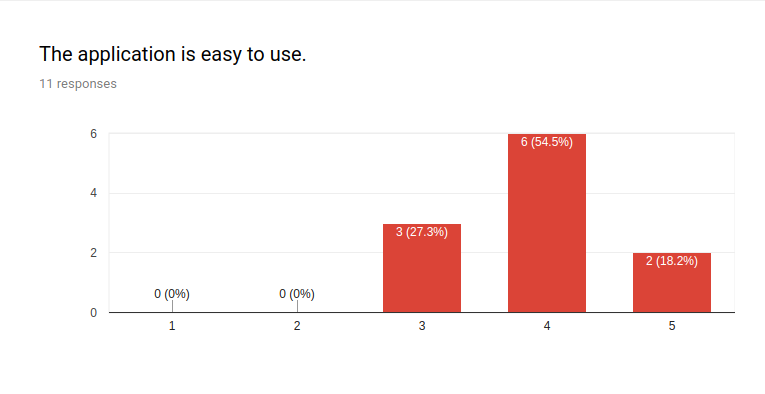

# User Testing

## User Testing Plan

To complete user testing we will hold two separate user testing sessions. We will have two sessions so that we can take feedback onboard from the first session and see what other issues users may find in the second session.

We will ask users to complete a survey and following on from this complete a short interview. Both of these methods will be utilised to ensure that we gather both qualitative and quantitative data to ensure that we are provided with as much information about our application as possible. Below is an example of our survey and questionnaire questions.

&nbsp;
&nbsp;

&nbsp;
&nbsp;
&nbsp;

&nbsp;
&nbsp;
&nbsp;

&nbsp;
&nbsp;

Once we have gathered this information we will take all feedback onboard to make corrections and changes that users would like to see present in Efficiclean.

## User Testing Phase 1

As mentioned in the user testing plan, we decided to implement our user testing in two phases. We would implement a week between these two user testing stages to allow us to make changes and improve our application before asking users what their opinions are now to ensure we implement all changes correctly.

*Question 1*           | *Question 2*           | *Question 3*
:---------------------:|:----------------------:|:---------------------:
 |  | 
The majority of those tested found the application easy to use.| Most found is pleasing to look at.|Those tested would use the appication

*Question 4*           | *Question 5*           | *Question 6*
:---------------------:|:----------------------:|:---------------------:
 |  | 
Most would recommend this application to a friend.| The results of this question were very widespread. We do not want any users to find the application frustrating to use so have to work on bug fixes and making the application less frustrating to use.|Users felt the application could be improved so we will work on this before the next round of user testing

*Question 7*           | *Question 8*           | *Question 9*
:---------------------:|:----------------------:|:---------------------:
 |  | 
Users were happy with how they learned to use the application. | Testers found a wide range of elements useful. Those most commonly mentioned included Map View and guests marking their rooms status.|Users key reasons pointed that they liked things to be easy, fast and kept track of.

*Question 10*           | *Question 11 a*             | *Question 11 b*
:---------------------:|:--------------------------:|:---------------------:
 |  | 
Users found Efficiclean easy to use, clever and fast. Unfortunately, one user mentioned the application was buggy. We will have to make sure to resolve this issue. |Users scored the application between 5 and 10. We would like to improve this score.|Here was can see the remainer of the legend

*Question 12*           | *Question 13*           | *Question 14*
:---------------------:|:----------------------:|:---------------------:
 |  | 
Again, Map View and Marking room status were popular among users.|Users gave us some great advice on changes they would like to see implemented. We will investigate each of these options.|Although most users did not face difficulties with the application, over a third did. We would like to eradicate these issues.

*Question 15*           | *Question 16*           | *Question 17*
:---------------------:|:----------------------:|:---------------------:
 |  | 
The issues users faced were predominately down to bugs which we will fix. Some issues were with colour contrasts and font sizes which will be adjusted.|All users found the application enjoyable to use which we were delighted to see.|Overall, users enjoyed using our application but felt it needed some work.

### 6.2 User Testing Phase two

Our first stage of user testing taught us a vast amount about our application and what users would like to see in the application. We took all of the feedback from the first round of user testing onboard and applied it to our application. Thankfully, this paid off as we received improved feedback from our users. This can be seen throughout our survey results.

*Question 1*           | *Question 2*           | *Question 3*
:---------------------:|:----------------------:|:---------------------:
 |  | 
This score increased from our first phase of user testing. All respondents found the application easy to use.| This score also increased, the vast majority of users found the application pleasing to look at.|This also increased. Thankfully users would use the application.

*Question 4*           | *Question 5*           | *Question 6*
:---------------------:|:----------------------:|:---------------------:
 |  | 
Most would recommend this application to a friend.| Thankfully most users found the application not to be frustrating but unfortunately one user did. | The results of this question were widespread. Some users felt the application could be improved and later gave feedback on this.

*Question 7*           | *Question 8*           | *Question 9*
:---------------------:|:----------------------:|:---------------------:
 |  | 
Yet again all users were happy with how they learned to use the application. | Again Map View and Marking Room Status were the aspects of the application that users found most useful. Again there was a wide range of responses to this question. |Users liked that the named features were fast, easy to use and simple.

*Question 10*           | *Question 11 a*             | *Question 11 b*
:---------------------:|:--------------------------:|:---------------------:
 |  | 
There was no negative remarks in this section as before. Users were very happy with the application and found it helpful, fast and clever. |Users scored the application between 7 and 10. This score has increased for 5-10 last time. We are delighted with this increase. | This diagram shows the later end of the legend.

*Question 12*           | *Question 13*           | *Question 14*
:---------------------:|:----------------------:|:---------------------:
 |  | 
Again, Map View and Marking room status were popular among users.|Advice given by users was very helpful and will be taken onboard. |A very small percentage of users faced difficulties with the application. We hope to resolve this issue.

*Question 15*           | *Question 16*           | *Question 17*
:---------------------:|:----------------------:|:---------------------:
 |  | 
The user gave feedback on the issue they were facing. We will resolve this issue.|Again, all users found the application enjoyable to use which we were delighted to see.|Overall, users were happy with our application.

User testing was very helpful in helping us discover issues that we would not have discovered without this testing. Different points of view meant exploring aspects of the application which we had not considered and brought about many issues which will be fixed. As the results show, users opinions of the application greatly increased between both phases of testing which assured us that we were heading the correct way with our changes. We gave users a voice to help us tailor Efficiclean to the user and it greatly impacted the application.
