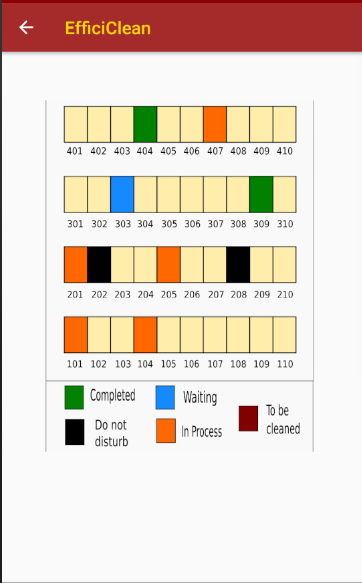
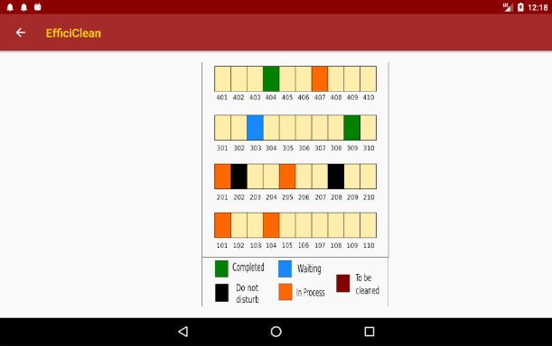
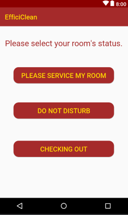

## Accessibility Testing

#### Sight Difficulties
For users with sight difficulties, the Efficiclean mobile application, although as usable as possible, may not be very easy to use. For this reason, we developed a web interface which was been vigorously accessibility tested. Guests who suffer from sight difficulties can use this interface to mark there room status and receive a notification to inform them when their room has been cleaned.

#### Colour Blindness
To ensure Efficiclean was usable for users who suffer from colour blindness, we were careful to make sure that contrasting colours were not used together. Similarly, we had to ensure colours on the Map View did not contrast.

*Mobile Interface*              | *Tablet interface*
:------------------------------:|:----------------------------------:
 | 

#### Hearing Difficulties
As Efficiclean has no audio within the application their will be no difficulties present for users with hearing difficulties. The only aspect of Efficiclean which involves audio are the push notifications. One example of these push notifications are the alerts which let users know that their room has been cleaned.

#### Motor Skills
Users who suffer from poor motor skills benefit from elements which will be used in sequence placed close together. This structure is evident throughout Efficiclean. Buttons should also be large to ensure they are easier to tap. Similarly to users experiencing sight issues, guests with motor issues may benefit from using the web interface as they can avail of the use of the keyboard.

*Mobile Interface*              | *Tablet interface*
:------------------------------:|:----------------------------------:
  | 
Large buttons to make it easier to use to users with poor motor skills.| Tablet interface also has large buttons for accessibility purposes.
