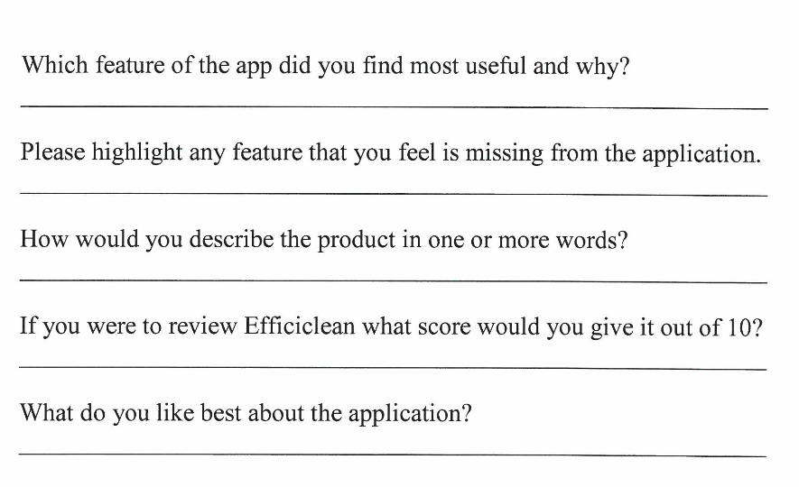
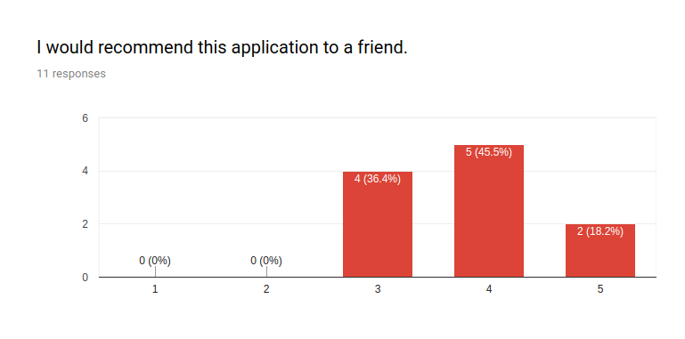
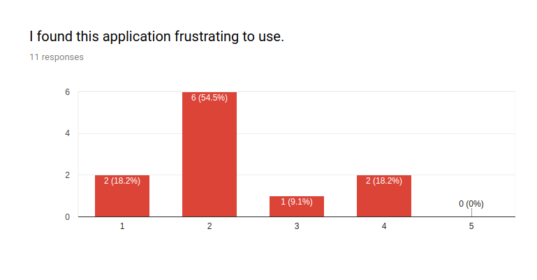
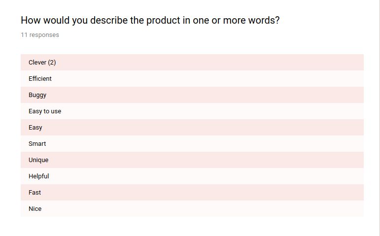
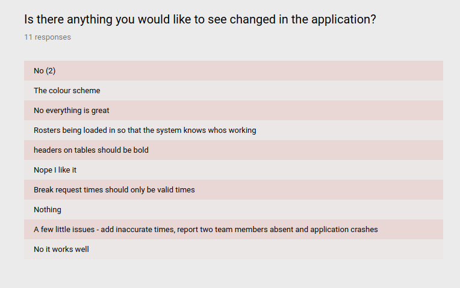
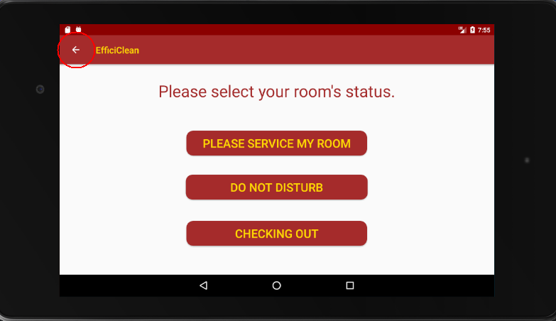

# CA326 Testing Documentation - EfficiClean

## Team Members:
- Conor Hanlon
- Shauna Moran

## Table of Contents
- [**1. Use Case Testing**](#1-use-case-testing)
- [**2. Gitlab Continuous Integration Pipeline**](#2-gitlab-continuous-integration-pipeline)
- [**3. Unit Testing**](#3-unit-testing)
- [**4. Instrumented Testing**](#4-instrumented-testing)
- [**5. User Testing**](#5-user-testing)
  + [5.1 User Testing Plan](#51-user-testing-plan)
  + [5.2 User Testing Phase One](#52-user-testing-phase-one)
  + [5.3 User Testing Phase Two](#53-user-testing-phase-two)
- [**6. Heuristic Testing**](#6-heuristic-testing)
- [**7. Accessibility Testing**](#7-accessibility-testing)
- [**8. Issues and Solutions**](#8-issues_and_solutions)


## 1. Use Case Testing

*Reference number*   | *Scenario*              |*Result*               |*Developers comments/ Proposed solution*
:------------------------------:|:-----------------------:|:---------------------:|:---------------------------------------:
001 | Guest login to the application | Guest logged in successfully |As intended
002 | Guest mark room “Please Service my Room” | Room successfully marked and information page displayed | As intended
003 | Guest mark room “Do not disturb” | Room successfully marked and information page displayed | As intended
004 | Guest mark room “Checking out” | Room successfully marked but information page has message cut off | Information page needs text boxes resized
005 | Guest change room status | Room successfully marked but incorrect time displayed on estimated room service time. Current time: 12:28 Estimated time given: 11:43 |Make changes to “Guest Please Service” activity to resolve this issue.
006 | Guest log out | Correctly presented with pop up and logged out successfully | As intended
007 | Staff Login | Staff logged in successfully | As intended
008 | Staff check queue | Queue presented correctly | As intended
009 | Staff check today’s teams | Button works correctly and table presented correctly | As intended
010 | Staff view map | Button works correctly and map view presented correctly | As intended
011 | Staff Request Break | -> Page displayed correctly but enter on input field goes to new line. Usability issue. -> App crashes if “:” left out between hours and minute values -> No matter what break selected it says you have that breaks amount of minutes remaining -> Bug if break has already been assigned | -> Input type of field needs to be changed to only allow one line of input. -> We will remove the “:” from the input as it causes accessibility issues -> Further work is need in Break allocator to resolve this issues
012 | Staff Add room to queue | -> If user types in incorrect room number app crashes -> If users clicks room and enter and doesn’t mark status the app crashes | Changes must be made to current job class to rectify this issue
013 | Staff mark room as “Clean” | Room successfully marked as cleaned | As intended
014 | Staff mark room as “Severe Mess” | Hint for description is ”etDescription” | Must be changed to “Description” in xml
015 | Staff mark room as “Hazardous” | Room successfully marked and description sent | As intended
016 | Supervisor Login | Supervisor successfully logged in | As intended
017 | Supervisor view team’s progress | Team progress list correctly updated | As intended
018 | Supervisor report absence | Staff member successfully removed from queue | As intended
019 | Supervisor view map | Button works correctly and map view presented correctly | As intended
020 | Supervisor breaks approval | Break approved | As intended
021 | Supervisor “Service” approval | Room approved and team progress increased. Room disapproved and sent back to team | As intended
022 | Supervisor “Severe Mess” approval | Severe mess approved and sent back to team. Team get increased priority. | As intended
023 | Supervisor “Hazard” approval | Hazard approved. Room disapproved and sent back to team | As intended
024 | Reception Login | Reception Logged in successfully | As intended
025 | Reception View Map | Map displayed correctly | As intended
026 | Reception Check Out Room | Room checked out. Map updated successfully. | As intended


## 2. Gitlab Continuous Integration Pipeline

We are using the gitlab continuous integration pipeline to run our unit tests every time we push to git. This allows us to test our application numerous times a day to ensure that it was still functioning as expected. To set up the pipeline, we have a gitlab-ci.yml file which sets up the Android environment we are using.

Our git pipeline uses both JUnit and Espresso to run these unit tests. JUnit is a framework for writing java unit tests. We use this to unit test our functions to ensure that they were operating as intended. Espresso runs instrumented tests on an emulator. This means it checks elements such as login, buttons functionality, keyboard and page link up. We found this very useful for keeping our testing going as we implemented new features before we completed other rigorous tests on them.

Whenever the git pipeline fails, we are notified of what exact error was causing this failure. We can easily then fix the issue and push the commit without the error.


## 3. Unit Testing

### GuestLoginTest.java

```java
@RunWith(MockitoJUnitRunner.class)
public class GuestLoginTest {

    @Mock private GuestLogin mockActivity;

    @Before
    public void setUp() {
        MockitoAnnotations.initMocks(this);
        ProgressBar spinner = mock(ProgressBar.class);
        mockActivity.spinner = spinner;
    }

    @Test
    public void test_loginButtonClick_1() {
        doCallRealMethod().when(mockActivity).loginButtonClick(anyString(), anyString(), anyString(), anyString());
        mockActivity.loginButtonClick("0582", "101", "Conor", "Hanlon");
        verify(mockActivity, times(1)).setValidationValues("0582", "101", "Conor", "Hanlon");
    }

    @Test
    public void test_loginButtonClick_2() {
        doCallRealMethod().when(mockActivity).loginButtonClick(anyString(), anyString(), anyString(), anyString());
        mockActivity.loginButtonClick("", "", "staff1", "");

        verify(mockActivity, never()).setValidationValues("0582", "101", "Conor", "Hanlon");
        verify(mockActivity, times(1)).startActivity(any(Intent.class));
    }
}
```

-   This test class unit tests the login functionality of inital *GuestLogin* activity. It uses Mockito to mock the class, allowing us to track the operations performed as a result of our input.

-   The first test runs the *loginButtonClick* method with valid input in all fields. We use the static Mockito method *verify* to check that our code acts as we intended it to.

-   Next, we invoke the same method with the input that brings the user to the *StaffLogin* activity. We verify that an intent is invoked as a result of this method call.

-   Below is a screenshot of our tests failing on an early version of the test class:


-   We get a *NullPointerException* because our mock did not initialise our *ProgressBar* for the activity. Once we fixed this in the *setUp* method, our tests passed as intended.


### TeamTest.java

```java
public class TeamTest {

    @Test
    public void test() {
        Job job1 = new Job();
        job1.setPriority(0);
        job1.setRoomNumber("101");
        job1.setDescription("Clean room");
        job1.setCreatedBy("Conor");

        Job job2 = new Job();
        job2.setPriority(1);
        job2.setRoomNumber("205");
        job2.setDescription("Clean room");
        job2.setCreatedBy("Luke");

        Team team = new Team();
        team.setCleanCounter(0);
        team.setPriorityCounter(0);
        team.setStatus("Waiting");
        team.setCurrentJob(job1);
        team.setReturnedJob(job2);

        assertNotNull(team.getBreakRemaining());
        assertNotNull(team.getCleanCounter());
        assertNotNull(team.getCurrentJob());
        assertNotNull(team.getMembers());
        assertNotNull(team.getPriorityCounter());
        assertNotNull(team.getStatus());
        assertNotNull(team.getReturnedJob());

        assertEquals(team.getBreakRemaining(), 60);
        assertEquals(team.getMembers().size(), 0);

        team.addMember("James");
        team.addMember("Derek");
        team.addMember("Holly");
        team.addMember("Anne");

        assertEquals(team.getMembers().size(), 4);
        assertEquals(team.removeMember(1), "Derek");
        assertEquals(team.getMembers().size(), 3);
        assertNotSame(team.getCurrentJob(), team.getReturnedJob());
    }
}
```

-   *TeamTest* aims to test the functionality of the *Team* class. It creates an instance and calls the setter methods to allocate values to the object variables.

-   After the variables have been initialised, we use assertions to ensure that the object has no unexpected null classes. We also use *assertEquals* to check that the constructor performed the correct operations.

-   The *Team* class uses an *ArrayList* to store the identification keys of housekeepers assigned to that team. We lastly call methods of our custom class that are used to access this list, and test the operation results using assertions.   

### BreakTest.java

```java
public class BreakTest {

    @Test
    public void test() {
        Break break1 = new Break();
        break1.setTeamID("Team A");
        break1.setBreakTime("1230");
        break1.setBreakLength(45);

        Calendar t1 = Calendar.getInstance();
        t1.set(Calendar.HOUR_OF_DAY, 12);
        t1.set(Calendar.MINUTE, 30);
        t1.set(Calendar.SECOND, 0);
        Date time1 = t1.getTime();

        Calendar t2 = Calendar.getInstance();
        t2.set(Calendar.HOUR_OF_DAY, 14);
        t2.set(Calendar.MINUTE, 20);
        t2.set(Calendar.SECOND, 10);
        Date time2 = t2.getTime();

        assertFalse(break1.isAccepted());
        assertNotNull(break1.getBreakLength());
        assertNotNull(break1.getBreakTime());
        assertNotNull(break1.getTeamID());

        assertEquals(time1.getHours(), break1.getBreakTime().getHours());
        assertEquals(time1.getMinutes(), break1.getBreakTime().getMinutes());
        assertEquals(time1.getSeconds(), break1.getBreakTime().getSeconds());

        assertNotEquals(time2.getHours(), break1.getBreakTime().getHours());
        assertNotEquals(time2.getMinutes(), break1.getBreakTime().getMinutes());
        assertNotEquals(time2.getSeconds(), break1.getBreakTime().getSeconds());

        break1.setAccepted(true);

        assertTrue(break1.isAccepted());
        assertTrue(break1.getBreakLength() >= 0);
    }
}
```

-   *BreakTest* tests our custom *Break* class. It firstly creates an instance of *Break* followed by two seperate *Date* objects. *Break* creates its own instance using a formatted time string passed into the *setBreakTime* method. We test our *breakTime* variable against our test objects.

-   At first, our assertions which should have found that the *Date* instances were true failed.


-   After debugging our code, we realised that the reason our assertion was failing was because both *Date* objects had different Unix timestamps, which are precise to the millisecond. To fix our test, we compared the individual hour, minute and second values of the variables instead. Our test class ran successfully after making this change.


### ApprovalTest.java

```java
public class ApprovalTest {

    @Test
    public void test() {
        Job job1 = new Job();
        job1.setPriority(0);
        job1.setRoomNumber("101");
        job1.setDescription("Clean room");
        job1.setCreatedBy("Conor");

        Job job2 = new Job();
        job2.setPriority(1);
        job2.setRoomNumber("205");
        job2.setDescription("Clean room");
        job2.setCreatedBy("Luke");

        Job job3 = new Job();
        job3.setPriority(0);
        job3.setRoomNumber("310");
        job3.setDescription("Clean room");
        job3.setCreatedBy("Shauna");

        Approval service = new Approval();
        service.setCreatedBy("Dave");
        service.setJob(job1);

        HazardApproval hazard = new HazardApproval();
        hazard.setCreatedBy("Shane");
        hazard.setDescription("Corrosive chemicals in bath.");
        hazard.setJob(job2);

        SevereMessApproval severeMess = new SevereMessApproval();
        severeMess.setCreatedBy("Brian");
        severeMess.setDescription("Bathroom floor flooded.");
        severeMess.setJob(job3);

        assertFalse(service.getApproved());
        assertFalse(hazard.getApproved());
        assertFalse(severeMess.getApproved());

        assertNotNull(service.getCreatedBy());
        assertNotNull(service.getJob());
        assertNotNull(service.getPriorityCounter());

        assertNotNull(hazard.getDescription());
        assertNotNull(hazard.getCreatedBy());
        assertNotNull(hazard.getJob());
        assertNotNull(hazard.getPriorityCounter());

        assertNotNull(severeMess.getDescription());
        assertNotNull(severeMess.getCreatedBy());
        assertNotNull(severeMess.getJob());
        assertNotNull(severeMess.getPriorityCounter());

        assertTrue(hazard.getPriorityCounter() > severeMess.getPriorityCounter());
        assertTrue(hazard.getPriorityCounter() > service.getPriorityCounter());
        assertTrue(severeMess.getPriorityCounter() > service.getPriorityCounter());

        service.incrementPriorityCounter();

        assertTrue(hazard.getPriorityCounter() > service.getPriorityCounter());
        assertEquals(severeMess.getPriorityCounter(), service.getPriorityCounter());

        service.setApproved(true);

        assertTrue(service.getApproved());
        assertFalse(service.getJob().getStatus());

        service.getJob().markCompleted();

        assertTrue(service.getJob().getStatus());
    }
}
```

-   Multiple different custom classes are tested by *ApprovalTest*. *HazardApproval* and *SevereMessApproval* both inherit from the parent *Approval* class. The difference between the classes is their priority based on the importance of each different approval type.

-   Firstly, we create different *Job* objects before our different approvals are initialised. We then call setter methods to assign values to class variables and use assertions to ensure our operations were successful. This is followed by testing that our *priorityCounter* values were set correctly by the constructors through comparing our different objects. We then increment the *Approval* priority, and define new assertions for what we expect our values to be.

### JobTest.java

```java
public class JobTest {

    @Test
    public void test() {
        Job job1 = new Job();
        job1.setPriority(0);
        job1.setRoomNumber("101");
        job1.setDescription("Clean room");
        job1.setCreatedBy("Manager");

        assertFalse(job1.getStatus());
        assertTrue(job1.getTimestamp() > 0);
        assertNotNull(job1.getCreatedBy());
        assertNotNull(job1.getDescription());
        assertNotNull(job1.getPriority());
        assertNotNull(job1.getRoomNumber());

        Job job2 = new Job();
        job2.setPriority(0);
        job2.setRoomNumber("304");
        job2.setDescription("Wash sink");
        job2.setCreatedBy("Manager");

        assertEquals(job1.getPriority(), job2.getPriority());
        assertTrue(job1.getTimestamp() <= job2.getTimestamp());
        assertEquals(job1.getCreatedBy(), job2.getCreatedBy());
        assertNotEquals(job1.getDescription(), job2.getDescription());

        job1.markCompleted();
        assertTrue(job1.getStatus());
    }
}
```

-   Lastly, we have a simple test class to check the functionality of our *Job* class. We declare two objects and use assertions to check that the methods perform the correct operations.

## 4. Instrumented Testing

## 5. User Testing

### 5.1 User Testing Plan

To complete user testing we will hold two separate user testing sessions. We will have two sessions so that we can take feedback onboard from the first session and see what other issues users may find in the second session.

We will ask users to complete a survey and following on from this complete a short interview. Both of these methods will be utilised to ensure that we gather both qualitative and quantitative data to ensure that we are provided with as much information about our application as possible. Below is an example of our survey and questionnaire questions.

&nbsp;
&nbsp;


&nbsp;
&nbsp;
&nbsp;



&nbsp;
&nbsp;
&nbsp;


&nbsp;
&nbsp;

Once we have gathered this information we will take all feedback onboard to make corrections and changes that users would like to see present in Efficiclean.

### 5.2 User Testing Phase One

As mentioned in the user testing plan, we decided to implement our user testing in two phases. We would implement a week between these two user testing stages to allow us to make changes and improve our application before asking users what their opinions are now to ensure we implement all changes correctly.

*Question 1*           | *Question 2*           | *Question 3*
:---------------------:|:----------------------:|:---------------------:
 |  | 
The majority of those tested found the application easy to use.| Most found is pleasing to look at.|Those tested would use the appication


*Question 4*           | *Question 5*           | *Question 6*
:---------------------:|:----------------------:|:---------------------:
 |  | 
Most would recommend this application to a friend.| The results of this question were very widespread. We do not want any users to find the application frustrating to use so have to work on bug fixes and making the application less frustrating to use.|Users felt the application could be improved so we will work on this before the next round of user testing


*Question 7*           | *Question 8*           | *Question 9*
:---------------------:|:----------------------:|:---------------------:
 |  | 
Users were happy with how they learned to use the application. | Testers found a wide range of elements useful. Those most commonly mentioned included Map View and guests marking their rooms status.|Users key reasons pointed that they liked things to be easy, fast and kept track of.


*Question 10*           | *Question 11 a*             | *Question 11 b*
:---------------------:|:--------------------------:|:---------------------:
 |  | 
Users found Efficiclean easy to use, clever and fast. Unfortunately, one user mentioned the application was buggy. We will have to make sure to resolve this issue. |Users scored the application between 5 and 10. We would like to improve this score.|Here was can see the remainer of the legend

*Question 12*           | *Question 13*           | *Question 14*
:---------------------:|:----------------------:|:---------------------:
 |  | 
Again, Map View and Marking room status were popular among users.|Users gave us some great advice on changes they would like to see implemented. We will investigate each of these options.|Although most users did not face difficulties with the application, over a third did. We would like to eradicate these issues.


*Question 15*           | *Question 16*           | *Question 17*
:---------------------:|:----------------------:|:---------------------:
 |  | 
The issues users faced were predominately down to bugs which we will fix. Some issues were with colour contrasts and font sizes which will be adjusted.|All users found the application enjoyable to use which we were delighted to see.|Overall, users enjoyed using our application but felt it needed some work.

### 5.2 User Testing Phase two

Our first stage of user testing taught us a vast amount about our application and what users would like to see in the application. We took all of the feedback from the first round of user testing onboard and applied it to our application. Thankfully, this paid off as we received improved feedback from our users. This can be seen throughout our survey results.

*Question 1*           | *Question 2*           | *Question 3*
:---------------------:|:----------------------:|:---------------------:
 |  | 
This score increased from our first phase of user testing. All respondents found the application easy to use.| This score also increased, the vast majority of users found the application pleasing to look at.|This also increased. Thankfully users would use the application.


*Question 4*           | *Question 5*           | *Question 6*
:---------------------:|:----------------------:|:---------------------:
 |  | 
Most would recommend this application to a friend.| Thankfully most users found the application not to be frustrating but unfortunately one user did. | The results of this question were widespread. Some users felt the application could be improved and later gave feedback on this.


*Question 7*           | *Question 8*           | *Question 9*
:---------------------:|:----------------------:|:---------------------:
 |  | 
Yet again all users were happy with how they learned to use the application. | Again Map View and Marking Room Status were the aspects of the application that users found most useful. Again there was a wide range of responses to this question. |Users liked that the named features were fast, easy to use and simple.

*Question 10*           | *Question 11 a*             | *Question 11 b*
:---------------------:|:--------------------------:|:---------------------:
 |  | 
There was no negative remarks in this section as before. Users were very happy with the application and found it helpful, fast and clever. |Users scored the application between 7 and 10. This score has increased for 5-10 last time. We are delighted with this increase. | This diagram shows the later end of the legend.

*Question 12*           | *Question 13*           | *Question 14*
:---------------------:|:----------------------:|:---------------------:
 |  | 
Again, Map View and Marking room status were popular among users.|Advice given by users was very helpful and will be taken onboard. |A very small percentage of users faced difficulties with the application. We hope to resolve this issue.


*Question 15*           | *Question 16*           | *Question 17*
:---------------------:|:----------------------:|:---------------------:
 |  | 
The user gave feedback on the issue they were facing. We will resolve this issue.|Again, all users found the application enjoyable to use which we were delighted to see.|Overall, users were happy with our application.


User testing was very helpful in helping us discover issues that we would not have discovered without this testing. Different points of view meant exploring aspects of the application which we had not considered and brought about many issues which will be fixed. As the results show, users opinions of the application greatly increased between both phases of testing which assured us that we were heading the correct way with our changes. We gave users a voice to help us tailor Efficiclean to the user and it greatly impacted the application.

## 6. Heuristic Testing

### Shneiderman's Eight Golden Rules

#### Strive for consistency.

Throughout our application we ensured that similar terminology was used to avoid confusion. As you can see below, elements such as the submit button are recognisable on each page.


Resembling actions are carried out in the same manner. The consistency of each of these elements ensures that Efficiclean is easy to use.

##### Report Hazard and Severe Mess pages:
&nbsp;


##### List Hazard and Severe Mess pages:
&nbsp;


As we can see from each of the above pages, the background and font colours throughout Efficiclean are the same. We utilised red and gold as they symbolised royalty and high quality.

### Enable frequent users to use shortcuts.

At this current time there are no shortcuts built into Efficiclean as all actions must be carried out methodolocially. However, as future work, we would like to keep guests logged in until they leave the hotel when they will be automatically logged out.

### Offer informative feedback

Once a guest marks the status of their room they are informed which option they have selected and provided with information on this option. Similarly, once a staff member sends a room to supervisor approval they will receive a pop up to let them know the room has been sent for approval. This feedback allows users to know that the action they have completed has been successful.


### Design dialog to yield closure

Actions such as guests marking the status of their rooms has a clear sequence of actions. Guests first login to Efficiclean using their hotel ID, room number, first name and surname. They then progress onto the home screen and have three options “Please service my room”, “Do not disturb” and “Checking out”. Once the guest selects an option they are presented with a page to inform them what status there room is currently marked as.


&nbsp;

&nbsp;


### Offer simple error handling.

Users will not be able to make errors in Efficiclean as they will receive a pop up to inform them of their error. An example of this is if a user does not fill in a field when logging into the application. They will be informed that this needs to be changed for them to log into the application.


### Permit easy reversal of actions.

Throughout Efficiclean there is a back button in the toolbar to allow users to return to the previous page if they have made a mistake. Similarly, if a user marks their room as do not disturb, they have the option to change this until a certain time.



### Support internal locus of control

Users have full control of the application. The guests get to choose to the status of the rooms, the staff and supervisor get to select what actions they perform in the application. Users initiate all actions within the application.


### Reduce short-term memory load.

As our short term memory supports only 5 to 9 items at one time, we kept our user interface as simple as possible. This means that users are not overloaded with information and can enjoy using the application.


## 7. Accessibility Testing

#### Sight Difficulties
For users with sight difficulties, the Efficiclean mobile application, although as usable as possible, may not be very easy to use. For this reason, we developed a web interface which was been vigorously accessibility tested. Guests who suffer from sight difficulties can use this interface to mark there room status and receive a notification to inform them when their room has been cleaned. The web interface can be controlled through the use of a keyboard and does not require a mouse.

 *Web Login*                   | *Web Homepage*
:------------------------------:|:-----------------------:
 | 


#### Colour Blindness
To ensure Efficiclean was usable for users who suffer from colour blindness, we were careful to make sure that contrasting colours were not used together. Similarly, we had to ensure colours on the Map View did not contrast.

*Mobile Interface*              | *Tablet interface*
:------------------------------:|:----------------------------------:
 | 

#### Hearing Difficulties
As Efficiclean has no audio within the application their will be no difficulties present for users with hearing difficulties. The only aspect of Efficiclean which involves audio are the push notifications. One example of these push notifications are the alerts which let users know that their room has been cleaned.

#### Motor Skills
Users who suffer from poor motor skills benefit from elements which will be used in sequence placed close together. This structure is evident throughout Efficiclean. Buttons should also be large to ensure they are easier to tap. Similarly to users experiencing sight issues, guests with motor issues may benefit from using the web interface as they can avail of the use of the keyboard.

*Mobile Interface*              | *Tablet interface*
:------------------------------:|:----------------------------------:
  | 
Large buttons to make it easier to use to users with poor motor skills.| Tablet interface also has large buttons for accessibility purposes.

## 8. Issues and Solutions

*Issue*                        | *Solution*                       |*Testing methodology that discovered it*
:-----------------------------:|:--------------------------------:|:--------------------------------------:
