# User Testing

## User Testing Plan

To complete user testing we will hold two separate user testing sessions. We will have two sessions so that we can take feedback onboard from the first session and see what other issues users may find in the second session.

We will ask users to complete a survey and following on from this complete a short interview. Both of these methods will be utilised to ensure that we gather both qualitative and quantitative data to ensure that we are provided with as much information about our application as possible. Below is an example of our survey and questionnaire questions.

&nbsp;
&nbsp;

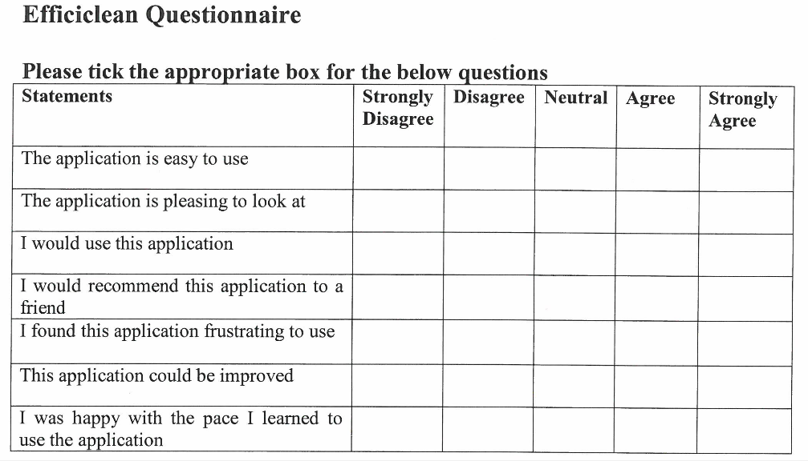

&nbsp;
&nbsp;
&nbsp;

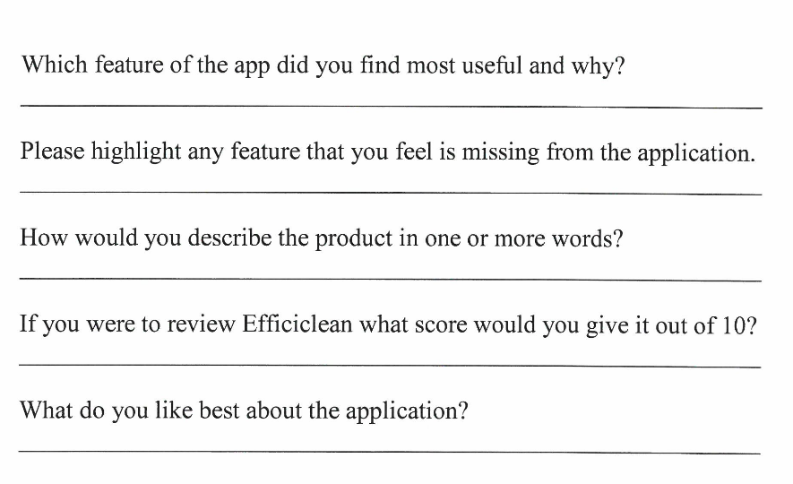

&nbsp;
&nbsp;
&nbsp;

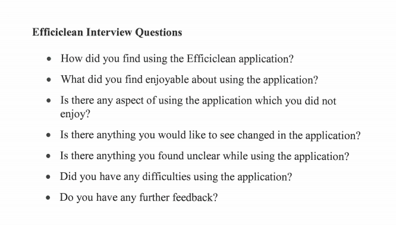

&nbsp;
&nbsp;

Once we have gathered this information we will take all feedback onboard to make corrections and changes that users would like to see present in Efficiclean.

## User Testing Phase 1

As mentioned in the user testing plan, we decided to implement our user testing in two phases. We would implement a week between these two user testing stages to allow us to make changes and improve our application before asking users what their opinions are now to ensure we implement all changes correctly.

*Question 1*           | *Question 2*           | *Question 3*
:---------------------:|:----------------------:|:---------------------:
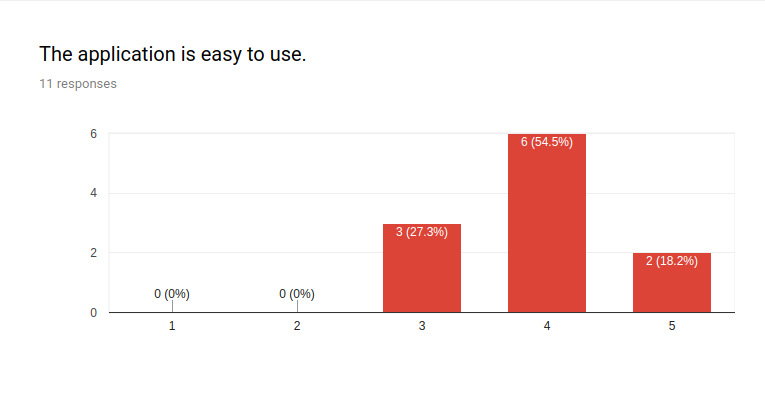 | 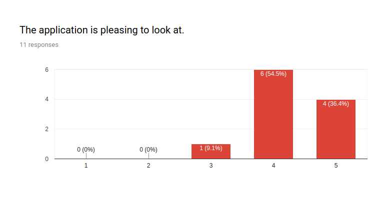 | 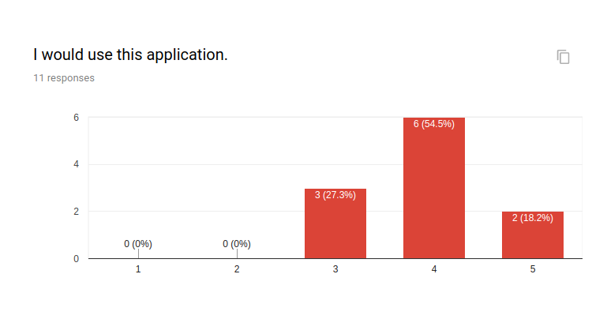
The majority of those tested found the application easy to use.| Most found is pleasing to look at.|Those tested would use the appication

*Question 4*           | *Question 5*           | *Question 6*
:---------------------:|:----------------------:|:---------------------:
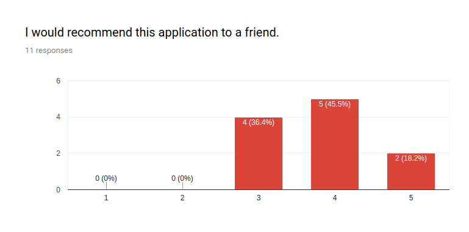 | 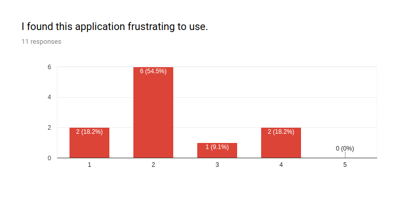 | 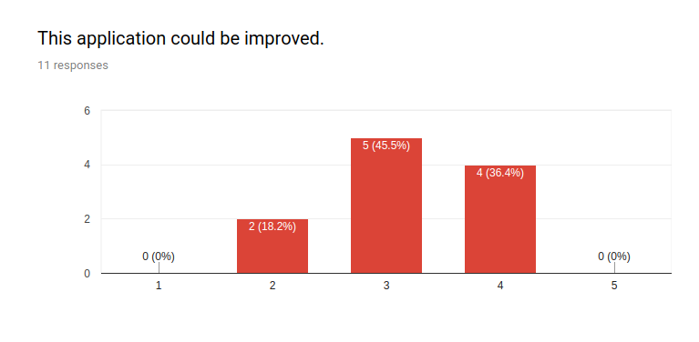
Most would recommend this application to a friend.| The results of this question were very widespread. We do not want any users to find the application frustrating to use so have to work on bug fixes and making the application less frustrating to use.|Users felt the application could be improved so we will work on this before the next round of user testing

*Question 7*           | *Question 8*           | *Question 9*
:---------------------:|:----------------------:|:---------------------:
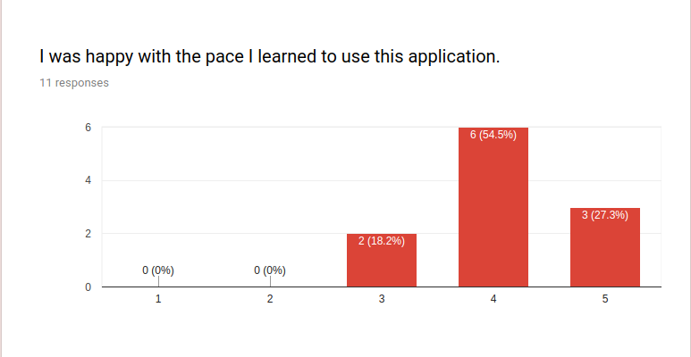 | 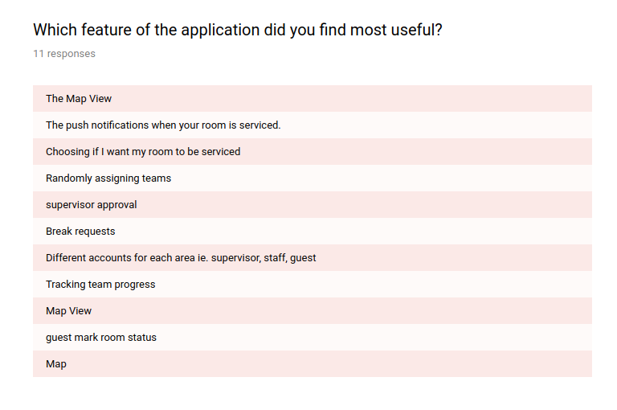 | 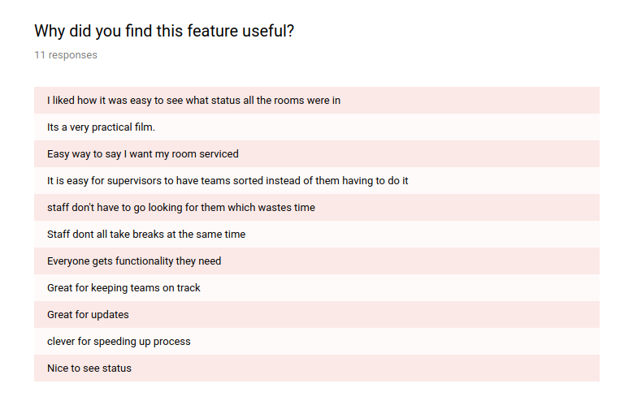
Users were happy with how they learned to use the application. | Testers found a wide range of elements useful. Those most commonly mentioned included Map View and guests marking their rooms status.|Users key reasons pointed that they liked things to be easy, fast and kept track of.

*Question 10*           | *Question 11 a*             | *Question 11 b*
:---------------------:|:--------------------------:|:---------------------:
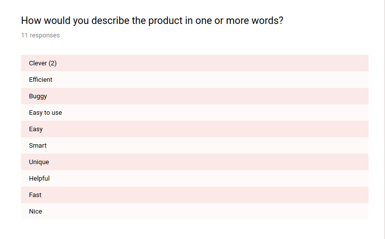 | 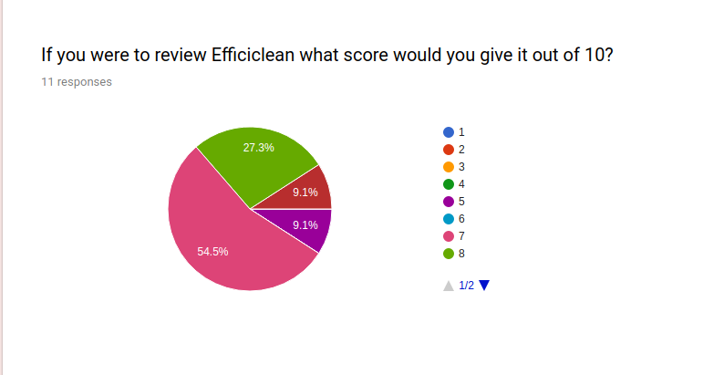 | 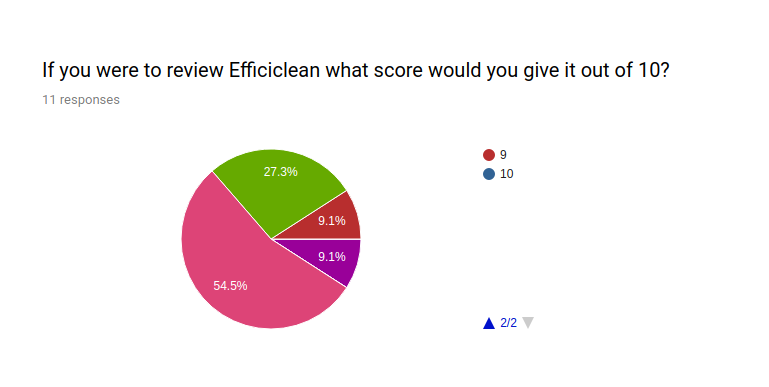
Users found Efficiclean easy to use, clever and fast. Unfortunately, one user mentioned the application was buggy. We will have to make sure to resolve this issue. |Users scored the application between 5 and 10. We would like to improve this score.|Here was can see the remainer of the legend

*Question 12*           | *Question 13*           | *Question 14*
:---------------------:|:----------------------:|:---------------------:
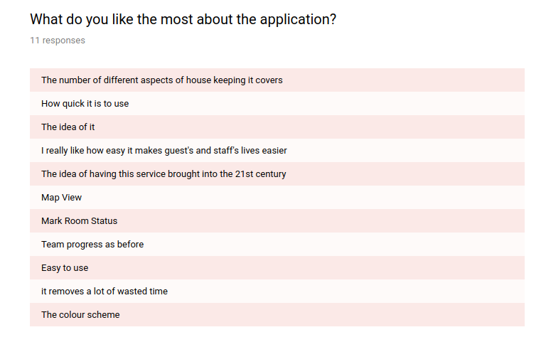 | 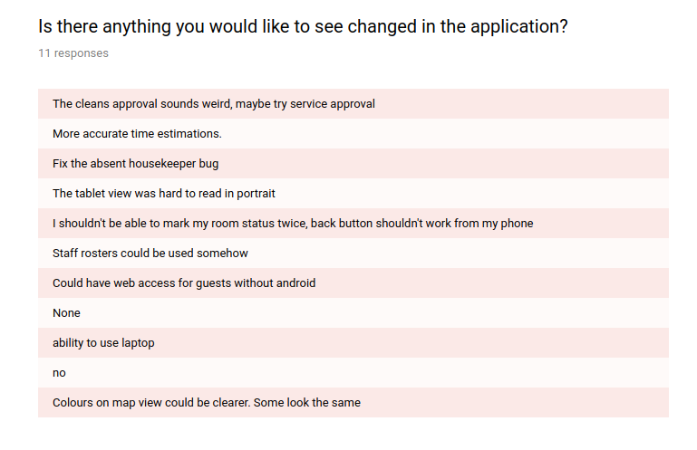 | 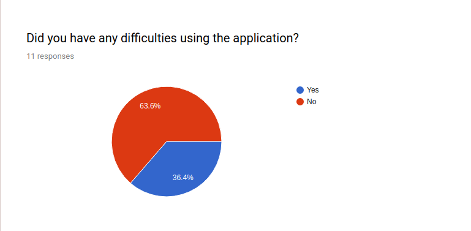
Again, Map View and Marking room status were popular among users.|Users gave us some great advice on changes they would like to see implemented. We will investigate each of these options.|Although most users did not face difficulties with the application, over a third did. We would like to eradicate these issues.

*Question 15*           | *Question 16*           | *Question 17*
:---------------------:|:----------------------:|:---------------------:
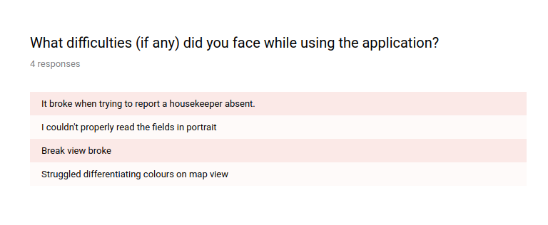 | 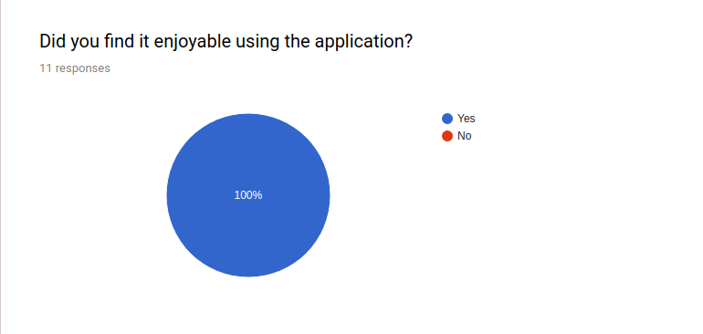 | 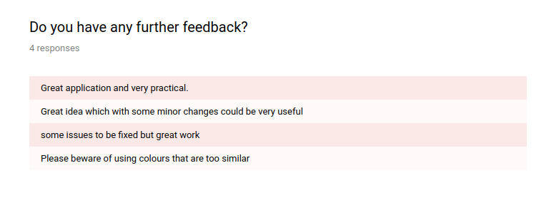
The issues users faced were predominately down to bugs which we will fix. Some issues were with colour contrasts and font sizes which will be adjusted.|All users found the application enjoyable to use which we were delighted to see.|Overall, users enjoyed using our application but felt it needed some work.
