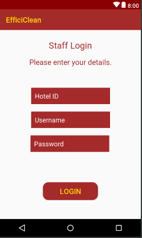
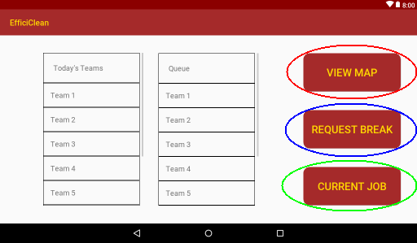
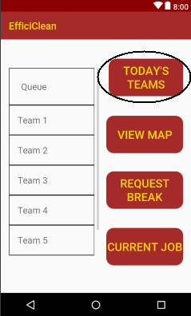
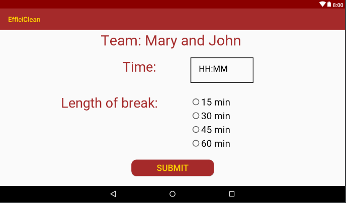
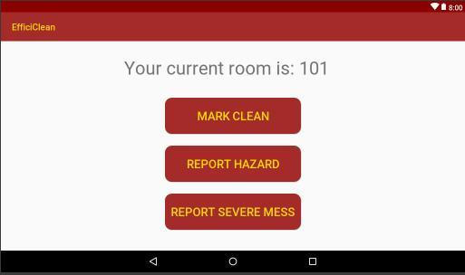

# Staff User Manual

## Installation

- To install the Efficiclean application go to the Google Play Store and search for “Efficiclean”
- Click on the Efficiclean application
- Click the install button
- Once the application has installed click the open button on this page

&nbsp;
## Login

- When you open Efficiclean you will be presented with the login page.
- This is the guest page
- In the forename field enter “staff1” as seen below

&nbsp;

*Mobile Interface*              | *Tablet interface*
:------------------------------:|:----------------------------------:
 | 

&nbsp;
- Click the Login button
- You will be presented with the following page
&nbsp;

*Mobile Interface*              | *Tablet interface*
:------------------------------:|:----------------------------------:
 | 

&nbsp;

- Enter your Hotel ID which can be obtained from your supervisor
- Enter your unique username and password which can also be obtained from your supervisor
- Click the Login button
&nbsp;

## The Home Screen (Tablet)
&nbsp;

&nbsp;
- As you can see from the above image above the staff homepage has five main elements
    - Today’s Teams
    - Queue
    - View Map button (highlighted in red)
    - Request Break button (highlighted in blue)
    - Current Room button (highlighted in green)

- The Today’s Team section will list the teams of the day.
- The queue will show the ordering of these teams to be assigned to a room
    - The team at the top of the queue is the team next to be assigned a room
- The View Map button (highlighted in red) shows a map view of the status of each room in the hotel
- The Request Break button (highlighted in blue) is where you and your team member can request your break. If you do not request a break one will be assigned to you.
- The Current Room button is for you and your team member to see what room you are currently assigned to and mark it’s status.
&nbsp;

## The Home Screen (Mobile)
&nbsp;

&nbsp;
- There is one small difference between the staff home page on tablet and mobile.
    - On the mobile interface the list of Today’s Teams can be accessed by clicking the Today’s Teams button (highlighted above) on the home screen.
&nbsp;

## View Map

&nbsp;

*Mobile Interface*              | *Tablet interface*
:------------------------------:|:----------------------------------:
 | 

&nbsp;

- Once you have clicked the View Map button you will be presented with the View Map screen.
- This screen presents you with the status of each room in the hotel.
- There is a legend at the bottom of the map for reference
    - Completed, rooms that have been cleaned, are marked green
    - Waiting, rooms that are awaiting approval by a supervisor, are marked yellow
    - Do not disturb, rooms of guest that do not wish for their rooms to be cleaned, are marked black
    - In Progress, rooms which are currently being cleaned, are marked orange
    - To be cleaned, rooms which are waiting to be cleaned, are marked red

&nbsp;

## Request Break

&nbsp;

*Mobile Interface*                     | *Tablet interface*
:-------------------------------------:|:--------------------------------------:
 | 

&nbsp;

- After you select the Request Break button you will be presented with the above screen
- To select the time which you would like to take the break,enter the time in the time box in the format HH:MM.
- Following this select an option for the length of the break you would like to take by tapping the box beside your prefered option.
- Click the submit button
- This break has now been sent to your supervisor for approval
- You will receive a notification to inform you if this break has been approved or disapproved.
&nbsp;

## Current Room

&nbsp;

*Mobile Interface*                 | *Tablet interface*
:---------------------------------:|:--------------------------------------:
 | 

&nbsp;

- When a room has been assigned to your team you will receive a push notification to alert you that you have been assigned a room.
- The room number will then be present on this screen.
- You will have three options to mark the room as:
    - Mark Clean, if you have completed cleaning the room
    - Report Hazard, if there is hazardous waste that will need a specialist cleaning team to clean such as blood or urine
    - Report Severe Mess, if the room is going to need a thorough clean due to a severe mess
- If you mark the room as Clean it will be sent to supervisor approval
    - If your supervisor deems that the room was not sufficiently cleaned, it will be returned to you with a message on what needs to be fixed
- If you mark a room as either hazardous or severe mess you will be requested to provide a description of the hazard or severe mess.
- Once you have entered this description, click submit and it will be sent to your supervisor for approval.
