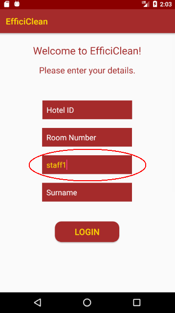
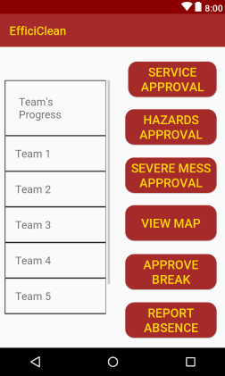
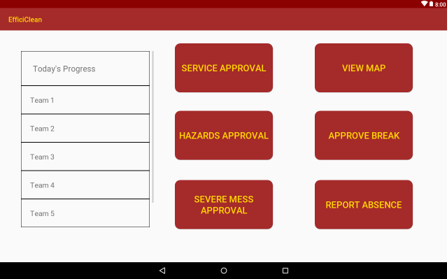
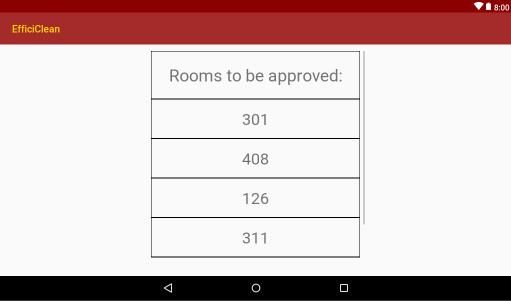
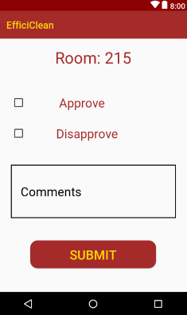
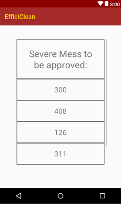
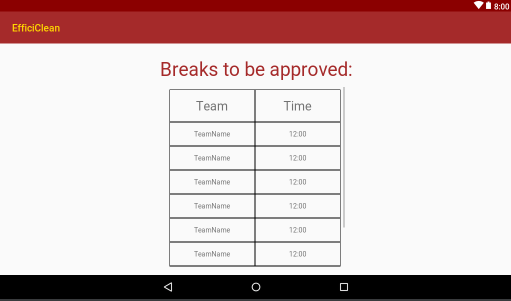
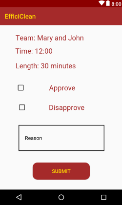
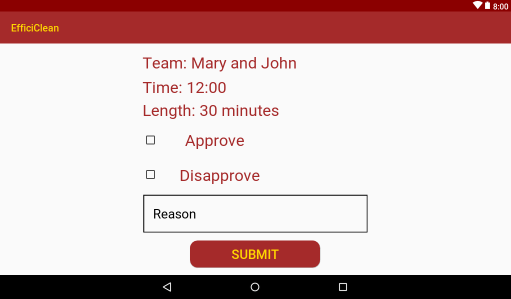

## Supervisor Manual

### Installation

- To install the Efficiclean application go to the Google Play Store and search for “Efficiclean”
- Click on the Efficiclean application
- Click the install button
- Once the application has installed click the open button on this page

### Login

- When you open Efficiclean you will be presented with the login page.
- This is the guest login page
- In the forename field enter “staff1” as seen below

*Mobile Interface*                 | *Tablet interface*
:---------------------------------:|:--------------------------------------:
 | 

- Click the Login button
- You will be presented with the following page

*Mobile Interface*                 | *Tablet interface*
:---------------------------------:|:--------------------------------------:
 | 

- Enter your Hotel ID
- Enter your unique username and password
- Click the Login button

### The Home Screen

*Mobile Interface*                 | *Tablet interface*
:---------------------------------:|:--------------------------------------:
 | 

- As you can see from the above image above the staff homepage has seven main elements
  - Today’s Progress
  - Cleans Approval
  - Hazards Approval
  - Severe Mess Approval
  - View Map
  - Approve Break
  - Report Absence

- The today’s teams progress on the left hand side of the screen is a list (ranging from highest to lowest) of the number of cleans each team has completed today.
- The cleans approval, hazards approval and severe mess approval buttons is where you can approve cleans that teams.
- The View Map button shows a map view of the status of each room in the hotel.
- Approve Break is used to approve breaks which staff members have requested
- Report Absence is used to report if a staff member is not present to remove them from the queue.
&nbsp;

### Cleans approval

*Mobile Interface*                 | *Tablet interface*
:---------------------------------:|:--------------------------------------:
 | 

- You will be provided with a list of rooms which are awaiting approval.
- To select a room to approve simply click the room number

*Mobile Interface*                 | *Tablet interface*
:---------------------------------:|:--------------------------------------:
 | 

- When you select a room you will be presented with this page.
- The purpose of the cleans approval page is for you to approve a staffs room clean once it has been checked.
- If you wish to approve a clean:
  - Click the approve clean button
  - If you have any comments enter them in the comments box
  - Click the submit button
  - This room has been successfully marked as cleaned
- If you wish to disapprove a clean:
  - Click the disapprove clean button
  - If you have any comments enter them in the comments box
  - Click the submit button
  - This room will be returned to the staff member for further cleaning

### Hazards Approval

*Mobile Interface*                 | *Tablet interface*
:---------------------------------:|:--------------------------------------:
 | 

- Once you select the approve hazard option you will be presented with the above screen.
- To select a room to approve, click onto the room number you wish to approve / disapprove.

*Mobile Interface*                 | *Tablet interface*
:---------------------------------:|:--------------------------------------:
 | 

- This hazards approval page is for approving hazards which staff have submitted.
- At the top of page is a description which the staff member has submitted to describe the issue.
- Once you have checked the room, you may choose to approve or disapprove the hazard.
- If you wish to approve a hazard:
  - Click approve
  - If you have any comments enter them in the reason box
  - Click the submit button
  - The hazard has been successfully approved

- If you wish to disapprove a hazard:
  - Click disapprove
  - If you have any comments enter them in the reason box
  - Click the submit button
  - This room will be returned to the staff member for cleaning

### Severe Mess approval

*Mobile Interface*                 | *Tablet interface*
:---------------------------------:|:--------------------------------------:
 | 

- Once you select the approve hazard option you will be presented with the above screen.
- To select a room to approve, click onto the room number you wish to approve / disapprove.

*Mobile Interface*                 | *Tablet interface*
:---------------------------------:|:--------------------------------------:
 | 

- This severe mess approval page is for approving severe mess’ which staff have submitted.
- At the top of page is a description which the staff member has submitted to describe the issue.
- Once you have checked the room, you may choose to approve or disapprove the severe mess.
- If you wish to approve a severe mess:
  - Click approve
  - If you have any comments enter them in the reason box
  - Click the submit button
  - The severe mess has been successfully approved
- If you wish to disapprove a severe mess:
  - Click disapprove
  - If you have any comments enter them in the reason box
  - Click the submit button
  - This room will be returned to the staff member for cleaning

### View Map

*Mobile Interface*                 | *Tablet interface*
:---------------------------------:|:--------------------------------------:
 | 

- Once you have clicked the View Map button you will be presented with the View Map screen.
- This screen presents you with the status of each room in the hotel.
- There is a legend at the bottom of the map for reference
  - Completed, rooms that have been cleaned, are marked green
  - Waiting, rooms that are awaiting approval by a supervisor, are marked yellow
  - Do not disturb, rooms of guest that do not wish for their rooms to be cleaned, are marked black
  - In Progress, rooms which are currently being cleaned, are marked orange
  - To be cleaned, rooms which are waiting to be cleaned, are marked red

### Approve Break

*Mobile Interface*                 | *Tablet interface*
:---------------------------------:|:--------------------------------------:
 | 

- Once you select the approve break option you will be presented with the above screen.
- To select a break to approve, click onto the team break you wish to approve / disapprove.

*Mobile Interface*                 | *Tablet interface*
:---------------------------------:|:--------------------------------------:
 | 

- On this page you will see present the team members, the time which they wish to take a break and the length of the break they wish to take.
- If you wish to approve a team break:
  - Click approve
  - If you have any comments enter them in the reason box
  - Click the submit button
  - The break has been successfully approved
- If you wish to disapprove a team break:
  - Click disapprove
  - If you have any comments enter them in the reason box
  - Click the submit button

### Report Absence

*Mobile Interface*                 | *Tablet interface*
:---------------------------------:|:--------------------------------------:
 | 

- If a staff member is absent, you must mark them as absent on the application so that they are not assigned to rooms.
- To do this click on the staff member who is absent and click submit.
- This staff member is now successfully marked as absent.
