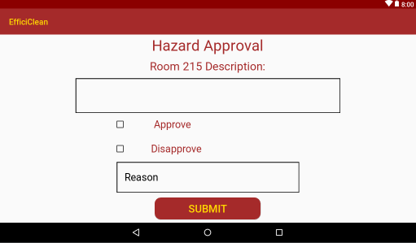

# CA326 User Manual - EfficiClean

## Team Members:
- Conor Hanlon
- Shauna Moran

## Table of Contents
- [**1. Guest User Manual**](#1-guest-user-manual)
  + [1.1 Installation](#11-installation)
  + [1.2 Login](#12-login)
  + [1.3 Mark Room Status](#13-mark-room-status)
  + [1.4 Log Out](#14-log-out)
- [**2. Housekeeping Staff User Manual**](#2-housekeeping-staff-user-manual)
  +	[2.1 Installation](#21-installation)
  + [2.2 Login](#22-login)
  + [2.3 The Home Screen (Tablet)](#23-the-home-screen-tablet)
  + [2.4 The Home Screen (Mobile)](#24-the-home-screen-mobile)
  + [2.5 View Map](#25-map-view)
  + [2.6 Request Break](#26-request-break)
  + [2.7 Current Job](#27-current-job)
- [**3. Supervisor User Manual**](#3-supervisor-user-manual)
  +	[3.1 Installation](#31-installation)
  + [3.2 Login](#32-login)
  + [3.3 The Home Screen](#33-the-home-screen)
  + [3.4 Service Approval](#34-service-approval)
  + [3.5 Hazards Approval](#35-hazards-approval)
  + [3.6 Severe Mess Approval](#36-severe-mess-approval)
  + [3.7 View Map](#37-map-view)
  + [3.8 Approve Break](#38-approve-break)
  + [3.9 Report Absence](#39-report-absence)

&nbsp;

## 1. Guest User Manual

### 1.1 Installation

- To install the Efficiclean application go to the Google Play Store and search for “Efficiclean”
- Click on the Efficiclean application
- Click the install button
- Once the application has installed click the open button on this page

&nbsp;
### 1.2 Login

- When you open Efficiclean you will be presented with the login page
- Your login details consist of the name which the room was booked under and the room and hotel information present on the back of your hotel room door
- To login please type in:
    - Hotel ID (present on the back of the room door)
    - Room Number (present on the back of the room door)
    - Forename (name which room is booked under)
    - Surname (name which room is booked under)
- Please see an example of this interface below

&nbsp;

*Mobile Interface*              | *Tablet interface*                 
:------------------------------:|:----------------------------------:
 |    

&nbsp;

### 1.3 Mark Room Status

- As you can see in the image below you will presented with three options to mark the status of your room
    - Please service my room
    - Do not disturb
    - Checking out
- Please service my room means that you would like your room to be cleaned
- Do not disturb means that you not wish for your room to be serviced
- Checking out means that you are checking out of the hotel.

&nbsp;

*Mobile Interface*              | *Tablet interface*                  
:------------------------------:|:----------------------------------:
  |   

&nbsp;

- After you have marked the status of your room you will be presented with a screen inform you of your choice
- If you mark your room as “Please service my room” you will be presented with the following screen

&nbsp;

*Mobile Interface*                     | *Tablet interface*                  
:-------------------------------------:|:--------------------------------------:
 |   

&nbsp;

- The highlighted area of this interface shows the region where your estimated clean time will be present.
    - This is the estimated time by which your room will be cleaned.
- When your room is cleaned you will receive a notification on your device to inform you that it has been cleaned.

- If you mark your room as “Do not disturb” you will be presented with the following screen

&nbsp;

*Mobile Interface*                     | *Tablet interface*                  
:-------------------------------------:|:--------------------------------------:
 |   

&nbsp;

- This page will give you a time you will be allowed to change this by if you wish to do so.
    - If you wish to change the status of your room to “Please Service my room” or “Checking out” press the return home button on this screen
    - You will be presented with the same home screen as before
    - Select the status which you wish to mark your room as

- You have now successfully marked the status of your room

### 1.4 Log Out

- To log out of Efficiclean click on the back button on the top left corner of the home screen.
- You will be be presented with the following pop up

&nbsp;

*Mobile Interface*                     | *Tablet interface*                  
:-------------------------------------:|:--------------------------------------:
    |   

&nbsp;

- Click Yes
- You have successfully signed out of the application

## 2. Housekeeping Staff User Manual

### 2.1 Installation

- To install the Efficiclean application go to the Google Play Store and search for “Efficiclean”
- Click on the Efficiclean application
- Click the install button
- Once the application has installed click the open button on this page

&nbsp;
### 2.2 Login

- When you open Efficiclean you will be presented with the login page.
- This is the guest page
- In the forename field enter “staff1” as seen below

&nbsp;

*Mobile Interface*              | *Tablet interface*
:------------------------------:|:----------------------------------:
 | 

&nbsp;
- Click the Login button
- You will be presented with the following page
&nbsp;

*Mobile Interface*              | *Tablet interface*
:------------------------------:|:----------------------------------:
 | 

&nbsp;

- Enter your Hotel ID which can be obtained from your supervisor
- Enter your unique username and password which can also be obtained from your supervisor
- Click the Login button
&nbsp;

### 2.3 The Home Screen (Tablet)
&nbsp;

&nbsp;
- As you can see from the above image above the staff homepage has five main elements
    - Today’s Teams
    - Queue
    - View Map button (highlighted in red)
    - Request Break button (highlighted in blue)
    - Current Job button (highlighted in green)

- The Today’s Team section will list the teams of the day.
- The queue will show the ordering of these teams to be assigned to a room
    - The team at the top of the queue is the team next to be assigned a room
- The View Map button (highlighted in red) shows a map view of the status of each room in the hotel
- The Request Break button (highlighted in blue) is where you and your team member can request your break. If you do not request a break one will be assigned to you.
- The Current Job button is for you and your team member to see what room you are currently assigned to and mark it’s status.
&nbsp;

### 2.4 The Home Screen (Mobile)
&nbsp;

&nbsp;
- There is one small difference between the staff home page on tablet and mobile.
    - On the mobile interface the list of Today’s Teams can be accessed by clicking the Today’s Teams button (highlighted above) on the home screen.
&nbsp;

### 2.5 View Map

&nbsp;

*Mobile Interface*              | *Tablet interface*
:------------------------------:|:----------------------------------:
 | 

&nbsp;

- Once you have clicked the View Map button you will be presented with the View Map screen.
- This screen presents you with the status of each room in the hotel.
- There is a legend at the bottom of the map for reference
    - Completed, rooms that have been cleaned, are marked green
    - Waiting, rooms that are awaiting approval by a supervisor, are marked yellow
    - Do not disturb, rooms of guest that do not wish for their rooms to be cleaned, are marked black
    - In Progress, rooms which are currently being cleaned, are marked orange
    - To be cleaned, rooms which are waiting to be cleaned, are marked red

&nbsp;

### 2.6 Request Break

&nbsp;

*Mobile Interface*                     | *Tablet interface*
:-------------------------------------:|:--------------------------------------:
 | 

&nbsp;

- After you select the Request Break button you will be presented with the above screen
- To select the time which you would like to take the break,enter the time in the time box in the format HH:MM.
- Following this select an option for the length of the break you would like to take by tapping the box beside your prefered option.
- Click the submit button
- This break has now been sent to your supervisor for approval
- You will receive a notification to inform you if this break has been approved or disapproved.
&nbsp;

### 2.7 Current Job
&nbsp;

*Mobile Interface*                 | *Tablet interface*
:---------------------------------:|:--------------------------------------:
 | 

&nbsp;

- When a room has been assigned to your team you will receive a push notification to alert you that you have been assigned a room.
- The room number will then be present on this screen.
- You will have three options to mark the room as:
    - Mark Clean, if you have completed cleaning the room
    - Report Hazard, if there is hazardous waste that will need a specialist cleaning team to clean such as blood or urine
    - Report Severe Mess, if the room is going to need a thorough clean due to a severe mess
- If you mark the room as Clean it will be sent to supervisor approval
    - If your supervisor deems that the room was not sufficiently cleaned, it will be returned to you with a message on what needs to be fixed
- If you mark a room as either hazardous or severe mess you will be requested to provide a description of the hazard or severe mess.
- Once you have entered this description, click submit and it will be sent to your supervisor for approval.

## 3. Supervisor User Manual

### 3.1 Installation

- To install the Efficiclean application go to the Google Play Store and search for “Efficiclean”
- Click on the Efficiclean application
- Click the install button
- Once the application has installed click the open button on this page

### 3.2 Login

- When you open Efficiclean you will be presented with the login page.
- This is the guest login page
- In the forename field enter “staff1” as seen below

*Mobile Interface*                 | *Tablet interface*
:---------------------------------:|:--------------------------------------:
 | 

- Click the Login button
- You will be presented with the following page

*Mobile Interface*                 | *Tablet interface*
:---------------------------------:|:--------------------------------------:
 | 

- Enter your Hotel ID
- Enter your unique username and password
- Click the Login button

### 3.3 The Home Screen

*Mobile Interface*                 | *Tablet interface*
:---------------------------------:|:--------------------------------------:
 | 

- As you can see from the above image above the staff homepage has seven main elements
  - Today’s Progress
  - Service Approval
  - Hazards Approval
  - Severe Mess Approval
  - View Map
  - Approve Break
  - Report Absence

- The Today’s Teams progress on the left hand side of the screen is a list (ranging from highest to lowest) of the number of service each team has completed today.
- The Service Approval, hazards approval and severe mess approval buttons is where you can approve service that teams.
- The View Map button shows a map view of the status of each room in the hotel.
- Approve Break is used to approve breaks which staff members have requested
- Report Absence is used to report if a staff member is not present to remove them from the queue.
&nbsp;

### 3.4 Service approval

*Mobile Interface*                 | *Tablet interface*
:---------------------------------:|:--------------------------------------:
 | 

- You will be provided with a list of rooms which are awaiting approval.
- To select a room to approve simply click the room number

*Mobile Interface*                 | *Tablet interface*
:---------------------------------:|:--------------------------------------:
 | 

- When you select a room you will be presented with this page.
- The purpose of the service approval page is for you to approve a staffs room clean once it has been checked.
- If you wish to approve a clean:
  - Click the approve clean button
  - If you have any comments enter them in the comments box
  - Click the submit button
  - This room has been successfully marked as cleaned
- If you wish to disapprove a clean:
  - Click the disapprove clean button
  - If you have any comments enter them in the comments box
  - Click the submit button
  - This room will be returned to the staff member for further cleaning

### 3.5 Hazards Approval

*Mobile Interface*                 | *Tablet interface*
:---------------------------------:|:--------------------------------------:
 | 

- Once you select the approve hazard option you will be presented with the above screen.
- To select a room to approve, click onto the room number you wish to approve / disapprove.

*Mobile Interface*                 | *Tablet interface*
:---------------------------------:|:--------------------------------------:
 | 

- This hazards approval page is for approving hazards which staff have submitted.
- At the top of page is a description which the staff member has submitted to describe the issue.
- Once you have checked the room, you may choose to approve or disapprove the hazard.
- If you wish to approve a hazard:
  - Click approve
  - If you have any comments enter them in the reason box
  - Click the submit button
  - The hazard has been successfully approved

- If you wish to disapprove a hazard:
  - Click disapprove
  - If you have any comments enter them in the reason box
  - Click the submit button
  - This room will be returned to the staff member for cleaning

### 3.6 Severe Mess approval

*Mobile Interface*                 | *Tablet interface*
:---------------------------------:|:--------------------------------------:
 | 

- Once you select the approve hazard option you will be presented with the above screen.
- To select a room to approve, click onto the room number you wish to approve / disapprove.

*Mobile Interface*                 | *Tablet interface*
:---------------------------------:|:--------------------------------------:
 | 

- This severe mess approval page is for approving severe mess’ which staff have submitted.
- At the top of page is a description which the staff member has submitted to describe the issue.
- Once you have checked the room, you may choose to approve or disapprove the severe mess.
- If you wish to approve a severe mess:
  - Click approve
  - If you have any comments enter them in the reason box
  - Click the submit button
  - The severe mess has been successfully approved
- If you wish to disapprove a severe mess:
  - Click disapprove
  - If you have any comments enter them in the reason box
  - Click the submit button
  - This room will be returned to the staff member for cleaning

### 3.7 View Map

*Mobile Interface*                 | *Tablet interface*
:---------------------------------:|:--------------------------------------:
 | 

- Once you have clicked the View Map button you will be presented with the View Map screen.
- This screen presents you with the status of each room in the hotel.
- There is a legend at the bottom of the map for reference
  - Completed, rooms that have been cleaned, are marked green
  - Waiting, rooms that are awaiting approval by a supervisor, are marked yellow
  - Do not disturb, rooms of guest that do not wish for their rooms to be cleaned, are marked black
  - In Progress, rooms which are currently being cleaned, are marked orange
  - To be cleaned, rooms which are waiting to be cleaned, are marked red

### 3.8 Approve Break

*Mobile Interface*                 | *Tablet interface*
:---------------------------------:|:--------------------------------------:
 | 

- Once you select the approve break option you will be presented with the above screen.
- To select a break to approve, click onto the team break you wish to approve / disapprove.

*Mobile Interface*                 | *Tablet interface*
:---------------------------------:|:--------------------------------------:
 | 

- On this page you will see present the team members, the time which they wish to take a break and the length of the break they wish to take.
- If you wish to approve a team break:
  - Click approve
  - If you have any comments enter them in the reason box
  - Click the submit button
  - The break has been successfully approved
- If you wish to disapprove a team break:
  - Click disapprove
  - If you have any comments enter them in the reason box
  - Click the submit button

### 3.9 Report Absence

*Mobile Interface*                 | *Tablet interface*
:---------------------------------:|:--------------------------------------:
 | 

- If a staff member is absent, you must mark them as absent on the application so that they are not assigned to rooms.
- To do this click on the staff member who is absent and click submit.
- This staff member is now successfully marked as absent.
